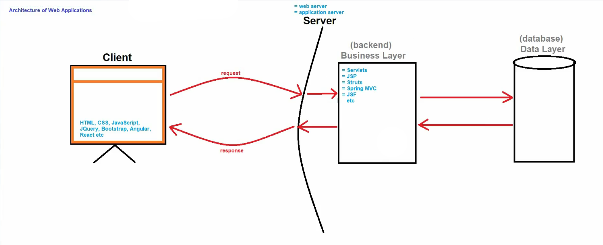
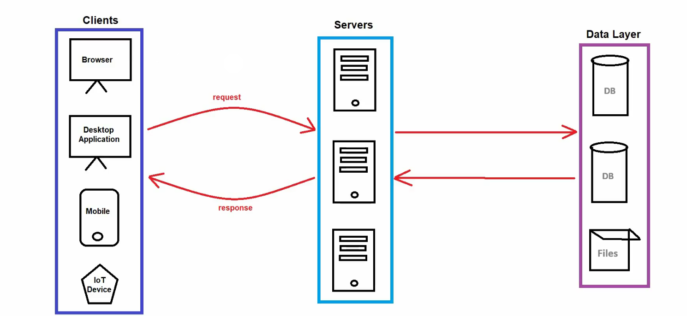
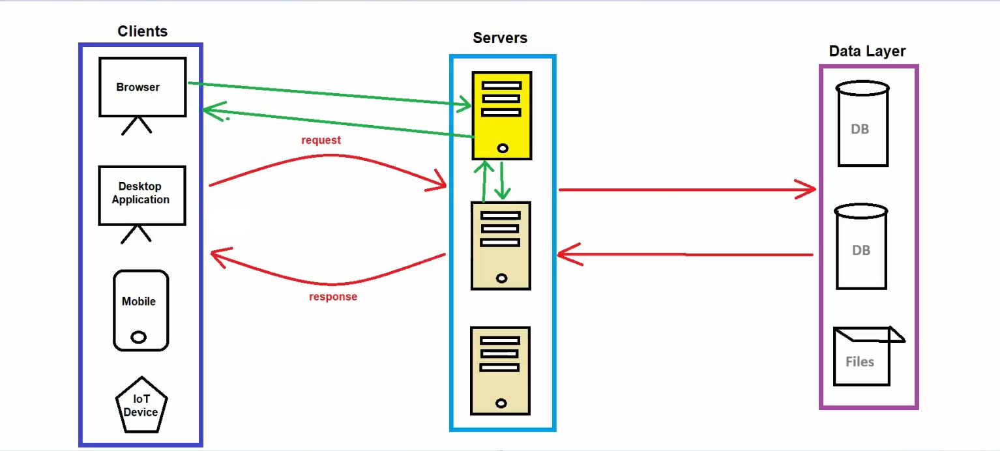
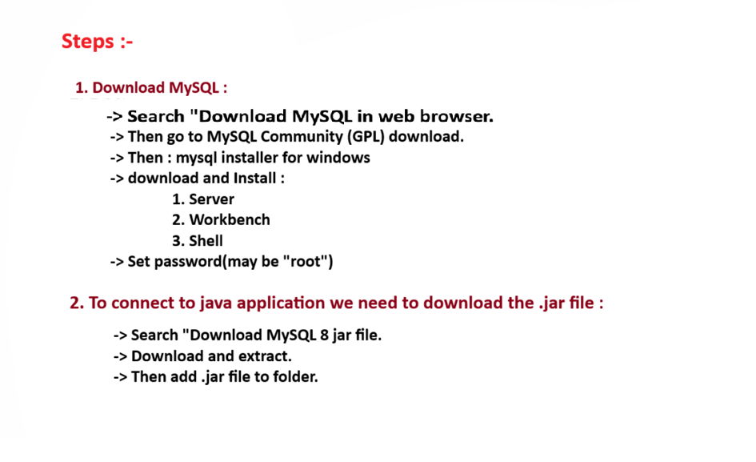

# ☕ Editions and Applications in Java

## 🗂️ Editions in Java
There are **3 editions in Java**:

1. **J2SE (Java 2 Standard Edition)** 🖥️
   - Also known as **Core Java**.

2. **J2EE (Java 2 Enterprise Edition)** 🏢
   - Also known as **Advanced Java**.

3. **J2ME (Java 2 Micro Edition)** 📱
   - Used for **Mobile and Embedded Systems**.
   - Examples: Remotes, ATMs, TVs, Washing Machines, etc.

---

# 📱 Types of Applications in Java

Java can be used to create **two types of applications**:

## 1. 🖥️ Standalone Applications
- Applications that run on a **single system**.
- Developed using **J2SE**.
- Do **not follow client-server architecture**.

### 🔀 Types of Standalone Applications

#### a. 🖤 CUI (Character User Interface)
- Console-based applications.
- Also called:
  - **Command Line Interface (CLI)**
  - **Text-Based Applications**

#### b. 🎨 GUI (Graphical User Interface)
- Applications with **graphical elements** like buttons, windows, menus, etc.

---

## 2. 🏢 Enterprise Applications
Enterprise applications are divided into:

1. 🌐 **Web Applications**
2. 🔗 **Distributed Applications**

---

# 🏛️ What is Enterprise?

The term **Enterprise** is used for **large-scale companies** that have multiple:

- 🏬 Departments
- 📊 Levels
- 🗂️ Divisions
- 👥 Groups

### 🏆 Examples

**TATA Group** 🏗️
- 🛒 Consumer & Retail
- 🏨 Hotels
- 💻 IT
- 🚗 Automobiles
- 🔩 Steel
- ⚡ Power

**Mahindra Group** 🚙
- 💻 IT
- 🚗 Automobiles
- 🛡️ Defence
- 📚 Education
- 💰 Financial Services

---

# 🏢 What are Enterprise Applications?

**Enterprise Applications** are:

- 📦 Large-scale applications
- 🔗 Distributed systems
- 💳 Transaction-based
- 🟢 Highly available systems

They are designed to support **enterprise-level business requirements**.

### 🛠️ Development Requirements
To develop enterprise applications, developers use:

- 🧰 Multiple technologies
- 🧩 Design patterns
- 🏗️ System architectures

---

# 🌐 Web Applications

### 🔧 Components

**🙍 Client**
- 🌍 Browser

**🖥️ Server**
- 🔌 Web Server
- ⚙️ Application Server

### 💡 Technologies Used
- Servlet
- JSP
- Spring MVC
- JSF
- Play Framework
- Struts

---

# 🔗 Distributed Applications

### 🙍 Client
- 🌍 Browser
- 🖥️ Desktop Applications
- 📱 Mobile Applications
- 🌐 IoT Devices

### 🖥️ Server
- ⚙️ Application Server

### 💡 Technologies Used
- 🫘 EJB (Enterprise Java Beans)
- 🌱 Spring Framework
- 🗄️ JPA (Java Persistence API)
- 🐘 Hibernate
- 💳 JTA (Java Transaction API)
- 📨 JMS (Java Message Service)

---

# ⚖️ Difference Between Web Server and Application Server

| 🔌 Web Server | ⚙️ Application Server |
|-------------|--------------------|
| 🪶 Lightweight | 🏋️ Heavyweight |
| Contains only **web containers** (Servlet, JSP container) | Contains **Web container + EJB container** |
| ✅ Good for **static content** like HTML pages | ✅ Good for **dynamic content** |
| 🟢 Consumes **less resources** (CPU, Memory) | 🔴 Uses **more resources** |
| Examples: **Apache Tomcat, Resin** | Examples: **WebLogic, JBoss, WebSphere** |

---

# 🧱 What is a Framework?

A **Framework** is a collection of **pre-written code** that acts as a **template** for developers.

In simple terms:
- Frameworks are **collections of APIs and tools** used to develop applications faster. 🚀

### 📦 Examples
- 🌱 Spring
- 🏗️ Struts
- 🐘 Hibernate
- 🅰️ Angular
- ⚛️ React

---

# ✅ Advantages of Frameworks

- ⚡ Faster development speed
- 🧹 Less code (reduces **boilerplate code**)
- 🔌 Easy **API integration**
- 🛠️ **Customizable** (mostly open-source)
- 🐛 Easier **debugging**
- 📖 Good **documentation support**

---

# 🗂️ Types of Frameworks

## 1. 🌐 Web Framework
Used for developing **web applications**.

**📦 Examples**
- 🏗️ Struts
- 🖥️ JSF

## 2. 🏢 Application Framework
Used for building **enterprise-level applications**.

**📦 Example**
- 🌱 Spring

