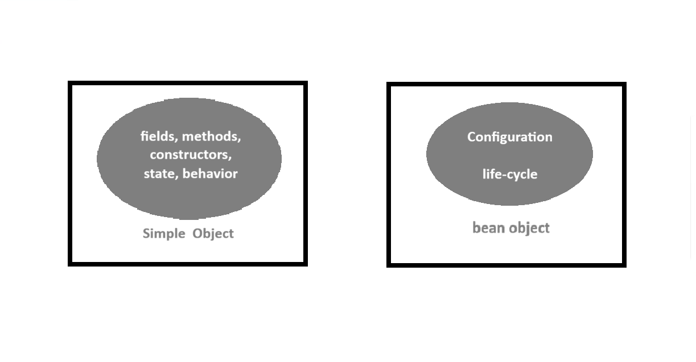
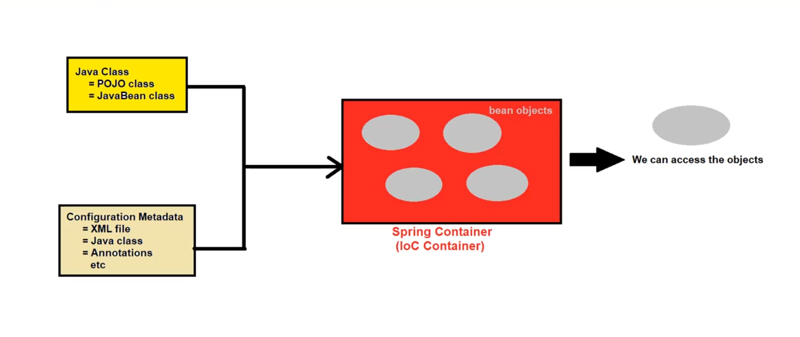

# 🌱 Spring Framework Notes

---

# 📌 What is Spring?

- Spring is an **Open Source Application Framework** used to develop different types of applications such as:
  - Standalone Applications
  - Enterprise Applications

- Spring framework was written by **Rod Johnson**.

📅 Important Information:
- Released under **Apache 1.0 License**
- First released in **June 2003**
- First production version **1.0 released in March 2004**
- Latest version: **Spring 6.x**

---

# 🚀 Advantages of Spring Framework

1️⃣ **Dependency Injection (DI)**  
- The process of **injecting dependent objects** into another object is called **Dependency Injection**.

OR

- Injecting properties or references of one object into another object.

---

2️⃣ **High Level Abstraction**  
- Simplifies application development and reduces boilerplate code.

3️⃣ **Enhanced Integration & Ecosystem**  
- Easily integrates with databases, messaging systems, and web frameworks.

4️⃣ **AOP (Aspect Oriented Programming)**  
- Separates cross-cutting concerns like logging, security, and transactions.

5️⃣ **Easy Testing**  
- Supports unit testing with frameworks like **JUnit**.

6️⃣ **Scalability & Maintainability**  
- Applications become loosely coupled and easier to maintain.

---

# ❤️ What is Spring Container?

- Spring Container is the **Heart / Core component of the Spring Framework**.

It works similar to:

- ☕ **JVM** → Executes Java programs  
- 🌐 **Servlet/JSP Container** → Executes Servlet and JSP pages  
- 🏢 **EJB Container** → Provides runtime environment for Enterprise Beans

---

# ⚙️ Responsibilities of Spring Container

### 1️⃣ Bean Creation & Initialization
Creates and initializes **Beans (Objects)** defined in Spring configuration.

### 2️⃣ Bean Configuration Handling
Loads configurations from:
- XML
- Annotations
- Java-based configuration files

### 3️⃣ Bean Lifecycle Management
Manages the complete lifecycle of beans including:
- `@PostConstruct`
- `@PreDestroy`

### 4️⃣ Bean Scope Management
Supports scopes like:
- Singleton
- Prototype

### 5️⃣ Dependency Injection (DI)
Automatically injects dependencies between objects.

### 6️⃣ AOP Support
Allows modularization of cross-cutting concerns such as:
- Logging
- Security
- Transactions

### 7️⃣ Integration with Other Technologies
Supports integration with:
- Databases
- Messaging Services
- Web frameworks

### 8️⃣ Internationalization (I18N)
Supports multiple languages for global applications.

### 9️⃣ Environment Management
Provides support for:
- Property sources
- Profiles for environment-specific configurations

### 🔟 Bean Post Processing
Allows modification of beans before and after initialization using **BeanPostProcessor**.

---

# 🧩 Types of Spring Container

1️⃣ **BeanFactory** (Old Container)  
2️⃣ **ApplicationContext** (Advanced Container)





---

# ⚙️ What do you mean by Configuration in Spring?

Configuration refers to **settings or instructions provided to the Spring Container** to manage an application.

### Types of Configuration

1. Bean Definitions  
2. Dependency Injection  
3. Bean Lifecycle  
4. Bean Autowiring  
5. Bean Post Processing  
6. Component Scanning  
7. Database Configuration  
8. AOP Configuration  
9. View Resolvers  
10. Security Configuration  
11. Property Files  

---

### Ways to Provide Configuration

1️⃣ XML Files  
2️⃣ Java Classes  
3️⃣ Annotations  
4️⃣ Property Files  
5️⃣ Environment Variables  
6️⃣ Command-line Arguments  
7️⃣ Profiles  

---

# 📂 Configuration Metadata File

- Also called **Spring Configuration File**.
- Contains configuration metadata for the Spring application.

It acts as a **central repository** for:

- Beans
- Dependencies
- Scopes
- Application settings

📌 Note:

If the configuration file is XML, the common name is: **applicationContext.xml**


---

# ☕ Bean Objects

- Bean objects are **objects of JavaBean / POJO classes** created and managed by the **Spring Container**.

    ✔ Beans are **not created manually by users**.  
    ✔ Their lifecycle is controlled by **Spring Container**.

Beans form the **backbone of a Spring application**.

---

### Important Bean Attributes

1️⃣ Class  
2️⃣ ID / Name  
3️⃣ Property Values  
4️⃣ Constructor Arguments  
5️⃣ Scope  
6️⃣ Lazy Initialization  
7️⃣ Autowiring  
8️⃣ Profile  
9️⃣ Initialization & Destruction Callbacks  
🔟 Bean Post Processors  

---

# 🧱 What is a POJO Class?

POJO stands for **Plain Old Java Object**.

It is a **simple Java class** used for encapsulation and modular design.

### Example

```java
public class Student
{
    String name;
    public int rollno;
    private int marks;

    // getter and setter methods
}
```

# 📦 What is JavaBean Class?

A JavaBean is a special type of POJO class that follows **specific rules**.

### Rules of JavaBean

1️⃣ Class must be public

2️⃣ Must implement Serializable interface

3️⃣ Must have public no-argument constructor

4️⃣ All properties must be private

5️⃣ Must have public getter and setter methods


``` java
import java.io.Serializable;

public class Student implements Serializable
{
    public Student(){}

    private String name;
    private int rollno;
    private int marks;

    public String getName() {
        return name;
    }

    public void setName(String name) {
        this.name = name;
    }

}
```

---

# 📌 Important Note

✔ **All JavaBean classes are POJO classes**  
❌ **But all POJO classes are not JavaBean classes**

---

# 🔍 Difference Between POJO and JavaBean

| POJO Class | JavaBean Class |
|-------------|---------------|
| No restrictions | POJO with restrictions |
| May or may not implement `Serializable` | Must implement `Serializable` |
| May or may not have a no-argument constructor | Must have a no-argument constructor |
| Fields can have any visibility | Fields must be `private` |
| Fields accessed directly | Fields accessed through **getter/setter methods** |
| Less control over members | Full control over members |
| Cannot use annotations | Can use annotations |
| No business logic | Can contain business logic |

---

# 🧑‍💻 Steps to Create First Spring Program

## 1️⃣ Install Requirements

Install the following:

- ☕ **JDK** (JDK 8 / 11 / 17)
- 🖥 **Eclipse IDE**

---

## 2️⃣ Download Spring JAR Files

Required Spring libraries:

- spring-beans-xxx.jar

- spring-core-xxx.jar

- spring-context-xxx.jar

- commons-logging-xxx.jar

- spring-expression-xxx.jar

## 3️⃣ Create Java Project : 
    Create a Java Project in Eclipse

## 4️⃣ Add JAR Files : 
    Create a lib folder and add all Spring JAR files.

## 5️⃣ Create POJO / JavaBean Class 
    - Example: Student.java

## 6️⃣ Create Configuration File

    - Example: applicationContext.xml

## 7️⃣ Create Main Class : Create a Main class to execute the Spring application.

```java

import org.springframework.context.ApplicationContext;
import org.springframework.context.support.ClassPathXmlApplicationContext;

public class Test {

    public static void main(String[] args) {

        ApplicationContext context =
        new ClassPathXmlApplicationContext("applicationContext.xml");

        Student s = (Student) context.getBean("student");

        System.out.println("Spring Application Started");
    }
}

```

## 🎯 Conclusion

### Spring Framework provides:
- Loose Coupling
- Dependency Injection
- Modular Architecture
- Easy Testing
- Scalable Enterprise Applications
- Which makes it one of the most popular Java frameworks for enterprise development.