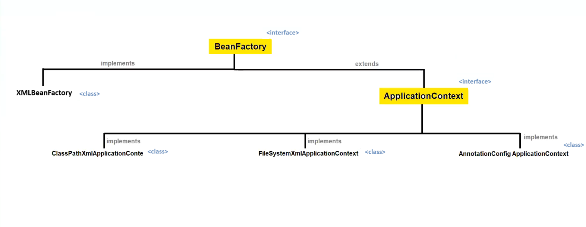
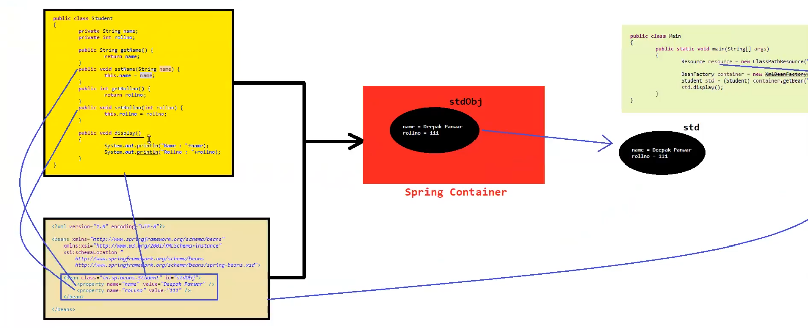
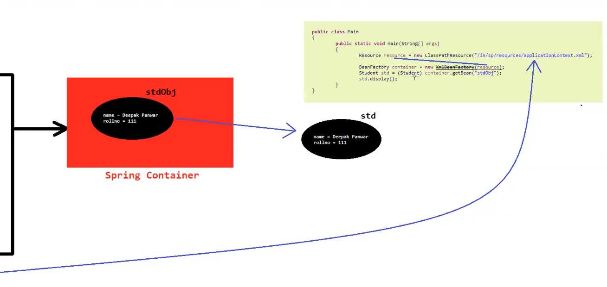

# 🌱 Spring Framework – Core Concepts

## 📦 Package Name Convention

In Java, package names are usually created using the **reverse of the organization's domain name**.

### Example:

| Organization Website                         | Package Name        |
| -------------------------------------------- | ------------------- |
| 🌐 [www.google.com](http://www.google.com)   | `com.google.beans`  |
| 🌐 [www.ypsillon.in](http://www.ypsillon.in) | `in.ypsillon.beans` |

✔ This helps maintain **uniqueness of package names** across projects.

---

# 📄 What is Resource?

➡ **Resource** is used whenever we need to **load or read external files** in a Spring application.

Examples of external resources:

* 📄 XML files
* 📑 Text files
* ⚙ Properties files
* 🖼 Images
* 📁 Other configuration files

📌 **Definition**

> Resource is a **predefined interface** present in the package:

```
org.springframework.core.io
```

---

## 📚 Implemented Classes of Resource

Spring provides multiple implementations of the `Resource` interface:

1️⃣ **ClassPathResource**

* Loads resource from the **classpath**

2️⃣ **URLResource**

* Loads resource from a **URL**

3️⃣ **InputStreamResource**

* Loads resource using **InputStream**

4️⃣ **ByteArrayResource**

* Loads resource from **byte array**

5️⃣ **FileSystemResource**

* Loads resource from **file system**

---

# 🏭 What is BeanFactory?

➡ **BeanFactory** is the **core interface** of the Spring Framework.

📌 **Definition**

> BeanFactory is responsible for **managing and accessing Spring beans**.

### Responsibilities

✔ Creating objects (Beans)

✔ Configuring beans

✔ Managing bean lifecycle

✔ Dependency Injection

📦 **Package**

```
org.springframework.beans.factory
```

💡 **Important**

BeanFactory acts as a **basic Spring Container**.

---

# 🚀 What is ApplicationContext?

➡ **ApplicationContext** is an **advanced version of BeanFactory**.

📌 **Definition**

> ApplicationContext is a **sub-interface of BeanFactory** used to manage and access beans with additional enterprise features.

### Features of ApplicationContext

✔ Bean management

✔ Internationalization (i18n) 🌍

✔ Event handling 📢

✔ Resource loading 📂

✔ Annotation support 🏷

✔ Automatic bean initialization ⚡

📦 **Package**

```
org.springframework.context
```

💡 **Simple Understanding**

| Container          | Description               |
| ------------------ | ------------------------- |
| BeanFactory        | Basic Spring container    |
| ApplicationContext | Advanced Spring container |

---

# 🏗 Hierarchy of Spring Container

```
BeanFactory
     │
     ▼
ApplicationContext
     │
     ▼
ConfigurableApplicationContext
     │
     ▼
AbstractApplicationContext
     │
     ▼
Concrete Implementations
     ├── ClassPathXmlApplicationContext
     ├── FileSystemXmlApplicationContext
     └── AnnotationConfigApplicationContext
```



---


## Program Explaination:-





# 🧠 Summary

🔹 **Resource** → Used to load external files.

🔹 **BeanFactory** → Basic Spring container.

🔹 **ApplicationContext** → Advanced Spring container with extra features.

🔹 **Spring Container Hierarchy** helps manage beans efficiently.

---

⭐ **Interview Tip**

> In real-world Spring applications, developers mostly use **ApplicationContext instead of BeanFactory** because it provides more features.
