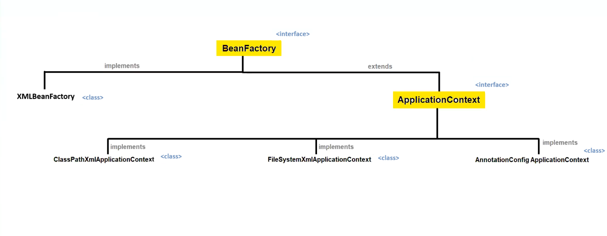
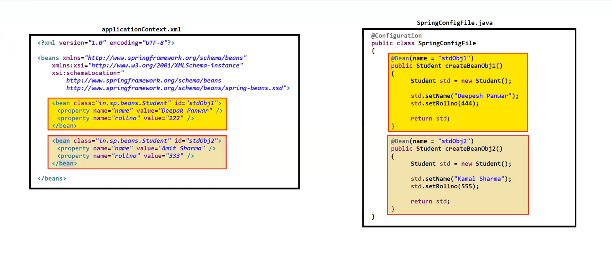

# 🌱 Spring Framework – Bean & Java Based Configuration Notes

---

# 🫘 What is Bean?

➡ **Bean** is an object that forms the **backbone of a Spring application**.

📌 **Definition**

> Beans are the objects that are **created, configured and managed by the Spring Container**.

✔ Spring container controls the **entire lifecycle of beans**.

📦 Beans are created using **configuration metadata** provided to the Spring container.

### 📝 Configuration Metadata can be provided using:

1️⃣ **XML Configuration File** (`.xml`)

2️⃣ **Java Configuration Class** (`.java`)

---

# ⚙ Important Attributes of Bean

Spring beans contain several configuration attributes.

### 📋 Main Bean Attributes

1️⃣ **Class**
→ Specifies the class whose object will be created.

2️⃣ **Id / Name**
→ Unique identifier of the bean.

3️⃣ **Property Values**
→ Used to inject values into bean properties.

4️⃣ **Constructor Arguments**
→ Used for constructor-based dependency injection.

5️⃣ **Scope**
→ Defines lifecycle and visibility of bean object.

6️⃣ **Initialization & Destruction Callbacks**
→ Methods executed during bean initialization and destruction.

7️⃣ **Lazy Initialization**
→ Bean is created only when required.

8️⃣ **Bean Post Processors**
→ Used to modify bean before and after initialization.

9️⃣ **Autowiring**
→ Automatically inject dependencies.

🔟 **Profiles**
→ Used to register beans for different environments.

---

# 🆔 What are `id` and `name` attributes in Bean?

Both **id** and **name** are used to provide **identity to bean objects**.

---

## 🔹 id Attribute

➡ `id` specifies the **unique identity of a bean object**.

✔ Each bean must have a **unique id** in the Spring container.

### Example

```xml
<bean id="studentBean" class="com.example.Student"/>
```

---

## 🔹 name Attribute

➡ `name` also specifies the **identity of bean objects**, but it is **more flexible than id**.

### Flexibilities of `name` attribute

1️⃣ We can assign **multiple names to a single bean**.

2️⃣ Multiple names can be separated by:

* comma `,`
* semicolon `;`
* space `" "`

3️⃣ Same bean name can be used in **both id and name attribute**.

4️⃣ Same name **cannot be given to multiple bean objects**.

### Example

```xml
<bean id="studentBean" name="std student studentObject" class="com.example.Student"/>
```

---

# ☕ Java Based Configuration

Before **Spring 3.0**, configuration metadata **had to be written in XML**.

From **Spring 3.0 onwards**, Spring allows **Java-based configuration**.

✔ Now configuration can be done using **Java classes instead of XML files**.

---

## 🚀 Steps to Create Java Based Configuration

### Step 1️⃣

Create a **configuration class** and annotate it with `@Configuration`.

### Step 2️⃣

Create **one or more methods** that return bean objects and annotate them with `@Bean`.

### Step 3️⃣

Create object of **AnnotationConfigApplicationContext** and access beans.

---

# 🏷 What is `@Configuration` Annotation?

➡ `@Configuration` is used with **Java classes**.

📌 It tells Spring that this class contains **bean configuration**.

### Working

✔ When the **Spring container starts**:

1. It scans classes marked with `@Configuration`
2. Loads them into memory
3. Processes them to create **bean definitions**

### Example

```java
@Configuration
public class AppConfig {

}
```

---

# 🏷 What is `@Bean` Annotation?

➡ `@Bean` annotation is used with **methods**.

📌 These methods are responsible for **creating and configuring bean objects**.

### Working

✔ When Spring container starts:

1️⃣ It invokes each `@Bean` method

2️⃣ Creates the bean object

3️⃣ Registers it inside the container

---

## 📝 Bean Naming Rule

By default:

> Bean name = Method name

### Example

```java
@Bean
public Student student() {
    return new Student();
}
```

✔ Bean name will be **student**

---

## ✏ Custom Bean Name

If we want to provide a **custom bean name**, we can use:

```java
@Bean(name = "studentBean")
```

### Example

```java
@Bean(name="studentBean")
public Student createStudent() {
    return new Student();
}
```

✔ Bean name will be **studentBean**

---


---

# => Hierarchy of Bean & ApplicationContext



---

---

# => Difference between xml and Java Config



---
# 🧠 Summary

🔹 **Bean** → Object managed by Spring Container.

🔹 **id** → Unique identifier of bean.

🔹 **name** → Flexible identifier for bean.

🔹 **@Configuration** → Marks configuration class.

🔹 **@Bean** → Creates and registers bean object.

🔹 **Java Configuration** → Alternative to XML configuration.

---

⭐ **Interview Tip**

> In modern Spring applications, developers prefer **Java Based Configuration with `@Configuration` and `@Bean` instead of XML configuration.**
