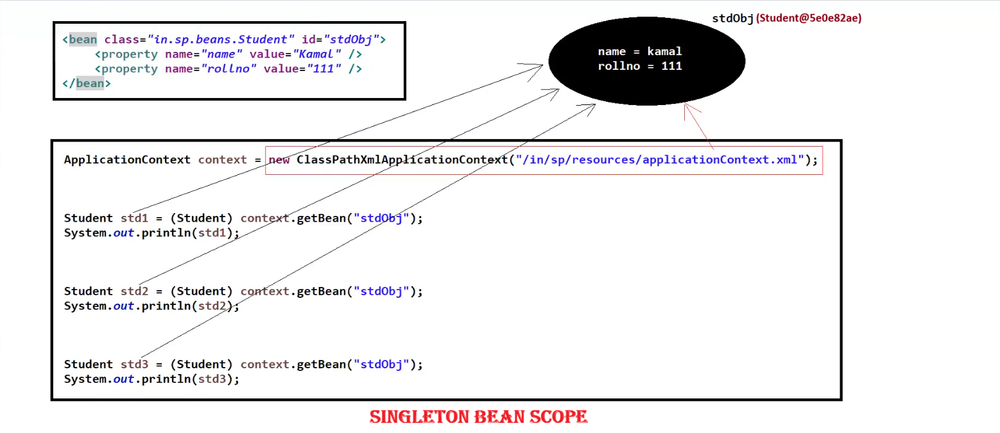
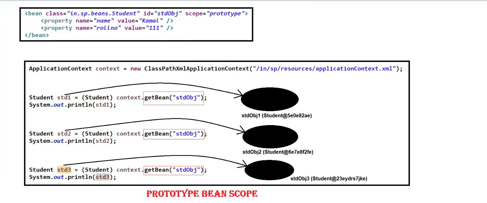

# 🌱 Spring Framework Notes

---

# 🧩 @Component Annotation

## 👉 @Component
- `@Component` is also known as a **Stereotype Annotation**.
- It is used to mark a class as a **Spring-managed component**.
- The **Spring Container** is responsible for:
  - Creating objects
  - Configuring objects
  - Managing lifecycle
  - Dependency Injection

📌 **Default Scope:** `singleton`

---

# 🏗 Examples of Spring Managed Components

Some commonly used Spring annotations:

1️⃣ `@Configuration`  
2️⃣ `@Bean`  
3️⃣ `@Component`
   - `@Controller`
   - `@Service`
   - `@Repository`  
   
4️⃣ `@Autowired`  
5️⃣ `@Aspect`

---

# ⚙ Different Ways to Create Bean Objects & Configure Properties

Spring provides **3 ways** to create beans.

---

# 1️⃣ Using XML Configuration

```xml
<bean class="fully qualified JavaBean class name" id="beanId">
    <property name="property_name" value="property_value"/>
    <property name="property_name" value="property_value"/>
</bean>
```

📌 In this approach:
- Beans are defined inside an **XML configuration file**
- Properties are injected using the `<property>` tag.

---

# 2️⃣ Using Java Configuration Class

```java
@Configuration
class JavaConfigFile
{
    @Bean
    public JavaBean m1()
    {
        JavaBean obj = new JavaBean();

        obj.setXXX(-);
        obj.setXXX(-);

        return obj;
    }
}
```

📌 In this approach:
- `@Configuration` marks the class as a **configuration class**
- `@Bean` method returns the **bean object** managed by Spring

---

# 3️⃣ Using Annotations

```java
@Component
public class JavaBean
{
    @Value("--")
    private String property_name;
}
```

📌 Important Note:
- We must either **register the JavaBean class**
- Or **scan the packages using component scanning**

---

# 📦 Bean Scope in Spring

## 👉 Bean Scope
- Bean scope defines the **visibility or accessibility of a bean** within the Spring container.

We can define scope using:
- `scope` attribute (XML)
- `@Scope` annotation

---

# 🔢 Types of Bean Scopes

Spring provides **7 scopes**:

1️⃣ `singleton`  
2️⃣ `prototype`  

Web-based scopes:

3️⃣ `request`  
4️⃣ `session`  
5️⃣ `globalSession`  
6️⃣ `application`  
7️⃣ `webSocket`

📌 **Default Scope:** `singleton`

---

# 🏠 Singleton Scope

- It is the **default scope** in Spring.
- Only **one instance** of the bean is created for the entire container.

✔ The same object is shared for every request using:

```java
getBean()
```

📌 Example Flow

```
Application Context
       |
       |---- Bean Object (Single Instance)
              |
              |---- Shared across all requests
```

---

---



---

# 🧬 Prototype Scope

- In this scope **a new instance is created every time the bean is requested**.

✔ Each call to:

```java
getBean()
```

creates a **new object**.

📌 Example Flow

```
Request 1 → New Bean Object
Request 2 → New Bean Object
Request 3 → New Bean Object
```

---

---



---
# ⚡ Quick Summary

| Scope | Description |
|------|-------------|
| Singleton | Only **one object** for the whole container |
| Prototype | **New object created for every request** |

---

✅ **Default Scope in Spring = Singleton**