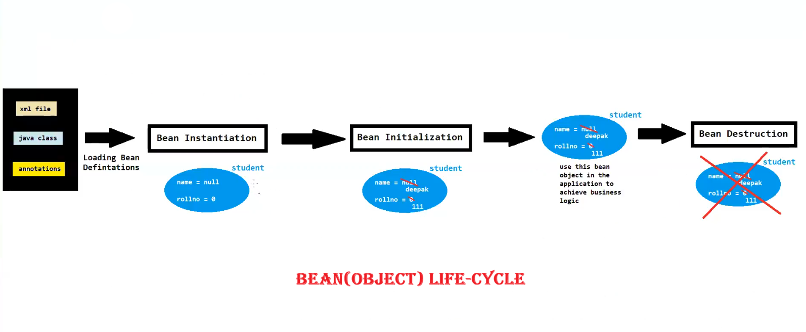
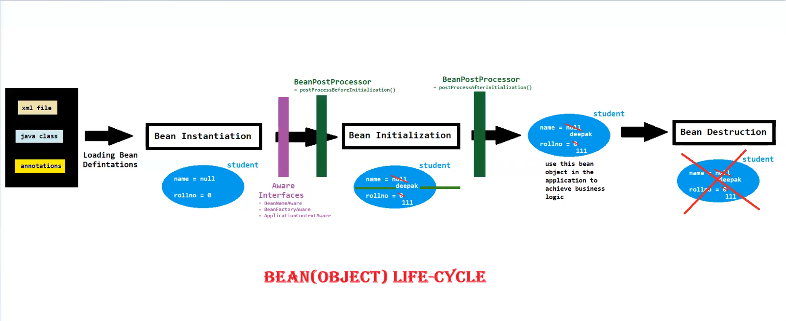

# 🌱 Spring Framework — Aware Interfaces & BeanPostProcessor

---

## 🔍 What are Aware Interfaces?

> Aware interfaces provide a way for beans to **interact with their environment** and obtain important resources during the **application context startup**.

- 📦 They allow beans to be "aware" of the Spring container's internals
- 🔗 Beans can access resources like their name, factory, or full application context
- ✅ Commonly used Aware interfaces:
  - `BeanNameAware`
  - `BeanFactoryAware`
  - `ApplicationContextAware`

> 💡 **Note:** Alternative approaches can be used in place of Aware interfaces depending on the use case.

---

## 🏷️ 1. BeanNameAware

**Purpose:** Makes the bean aware of its **assigned name** in the Spring container.

- 📌 Useful when a bean needs to know its own identifier
- 🔄 Helpful when interacting with other beans based on name
- 🛠️ Pre-defined interface method:

```java
void setBeanName(String beanName);
```

---

## 🏭 2. BeanFactoryAware

**Purpose:** Provides the bean with a reference to the **BeanFactory**.

- ⚙️ Useful when the bean needs to access other beans dynamically
- 🔨 Enables dynamic instantiation of other beans at runtime
- 🛠️ Pre-defined interface method:

```java
void setBeanFactory(BeanFactory beanFactory);
```

---

## 🌐 3. ApplicationContextAware

**Purpose:** Provides the bean with a reference to the **ApplicationContext**.

- 🚀 Similar to `BeanFactoryAware` but with **many extra features**
- 🌍 Extra features include:
  - Internationalization (i18n)
  - Event propagation
  - Resource loading
- 🛠️ Pre-defined interface method:

```java
void setApplicationContext(ApplicationContext applicationContext);
```

---

## 🔄 BeanPostProcessor

**Purpose:** Allows customization of the **bean instantiation and initialization** process.

> In simple words — it lets you perform **custom processing on beans** as they are being constructed and initialized by the Spring container.

- 🛠️ Pre-defined interface methods:

```java
Object postProcessBeforeInitialization(Object beanObj, String beanName);

Object postProcessAfterInitialization(Object beanObj, String beanName);
```

### 📊 Lifecycle Overview

```
Bean Instantiation
       ↓
postProcessBeforeInitialization() ← BeanPostProcessor
       ↓
Bean Initialization (e.g., @PostConstruct / afterPropertiesSet)
       ↓
postProcessAfterInitialization()  ← BeanPostProcessor
       ↓
Bean Ready for Use ✅
```

---

## 📝 Quick Summary Table

| Interface / Class | Key Method | Purpose |
|---|---|---|
| 🏷️ `BeanNameAware` | `setBeanName()` | Know the bean's name |
| 🏭 `BeanFactoryAware` | `setBeanFactory()` | Access the BeanFactory |
| 🌐 `ApplicationContextAware` | `setApplicationContext()` | Access full ApplicationContext |
| 🔄 `BeanPostProcessor` | `postProcessBefore/AfterInitialization()` | Custom processing around init |

---

---





---
*📚 Spring Framework Notes*