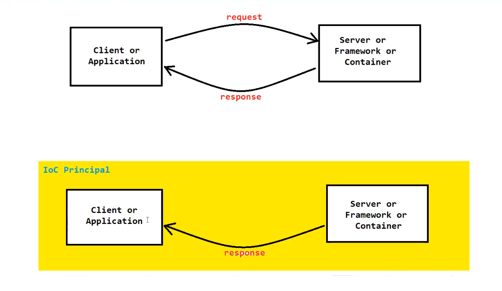
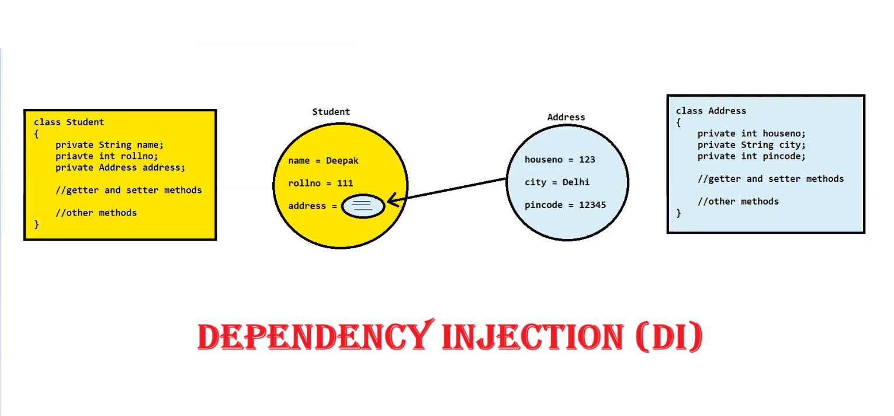
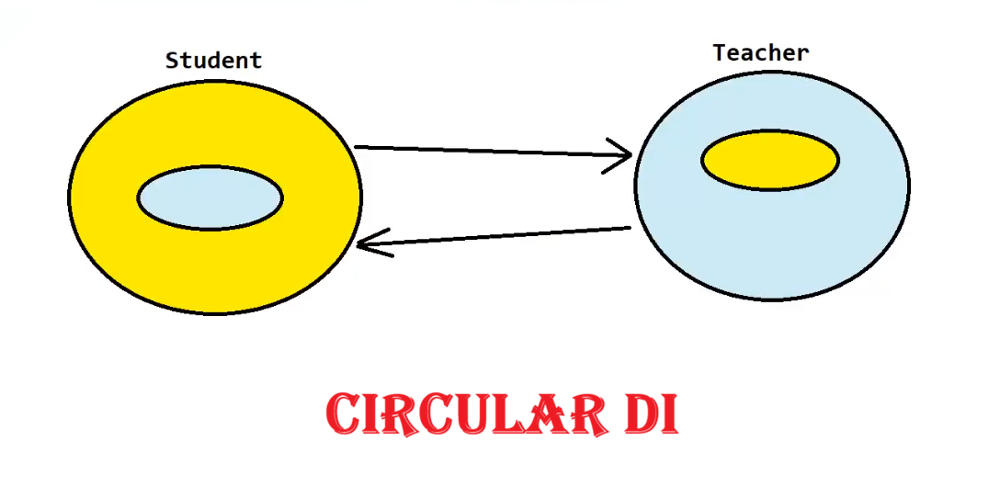

# 🔄 Spring Framework — IoC & Dependency Injection

---

## 🔃 Inversion of Control (IoC)

> **IoC** is a design pattern/principle that focuses on **inverting the control flow** of an application.

- 🔀 It shifts the responsibility of managing the **flow of execution** and **lifecycle of objects** from the application itself to an **external entity** (i.e., framework or container)
- 🔍 It identifies the client's required dependencies/services and then **creates & injects** them automatically — without any client request
- 🏗️ The **Spring Container** works on the basis of IoC and is thus also known as the **IoC Container**


---

## ✅ Advantages of IoC

| # | Advantage |
|---|-----------|
| 1️⃣ | 🔗 Classes are **loosely coupled** |
| 2️⃣ | 🧩 **Modularity** can be achieved |
| 3️⃣ | 🧪 Easier to **test and maintain** the application |

---

## 🛠️ Ways to Achieve IoC in Spring

| # | Approach |
|---|----------|
| 1️⃣ | 💉 **Dependency Injection (DI)** ⭐ *(Most Commonly Used)* |
| 2️⃣ | 🔎 Service Locator |
| 3️⃣ | 🔍 Contextualized Lookup |
| 4️⃣ | 📐 Template Method Design Pattern |
| 5️⃣ | 📡 Event Based IoC |

> 💡 **NOTE:** From the above, only **Dependency Injection (DI)** is the most commonly used IoC principle in Spring.

---

## 💉 Dependency Injection (DI)

> **DI** is a design pattern used to **implement the IoC principle**.

- 🎯 Its main functionality is to **"inject"** one object into another object
- 📦 It removes the need for the client to manually create or fetch its dependencies



### 🔧 Ways to Achieve DI in Spring (XML Configuration)

```
DI in Spring
    ├── 1️⃣ Setter Method DI
    └── 2️⃣ Constructor DI
```

---

## ⚖️ Setter Method DI vs Constructor DI

| # | Factor | 🔧 Setter Method DI | 🏗️ Constructor DI |
|---|--------|--------------------|--------------------|
| 1️⃣ | **How Dependency is Injected** | Uses `setXXX()` setter methods | Uses the **constructor** |
| 2️⃣ | **Readability** | ✅ More readable — property name & value provided | ❌ Less readable — no property name with value |
| 3️⃣ | **Partial Dependency** | ✅ Possible | ❌ Not possible |
| 4️⃣ | **Circular DI** | ✅ Can be achieved | ❌ Cannot be achieved |



---

## 🔁 IoC Flow Overview

```
🖥️ Application Starts
        ↓
🏗️ Spring IoC Container Initializes
        ↓
🔍 Identifies Required Dependencies
        ↓
💉 Injects Dependencies into Beans
        ↓
✅ Application Ready to Use
```

---

## 📝 Quick Summary

| Concept | Description |
|---|---|
| 🔃 **IoC** | Inverts control — framework manages object lifecycle |
| 💉 **DI** | Injects dependencies into objects automatically |
| 🔧 **Setter DI** | Uses setter methods; supports partial & circular DI |
| 🏗️ **Constructor DI** | Uses constructor; more strict, no partial/circular DI |

---

*📚 Spring Framework Notes*