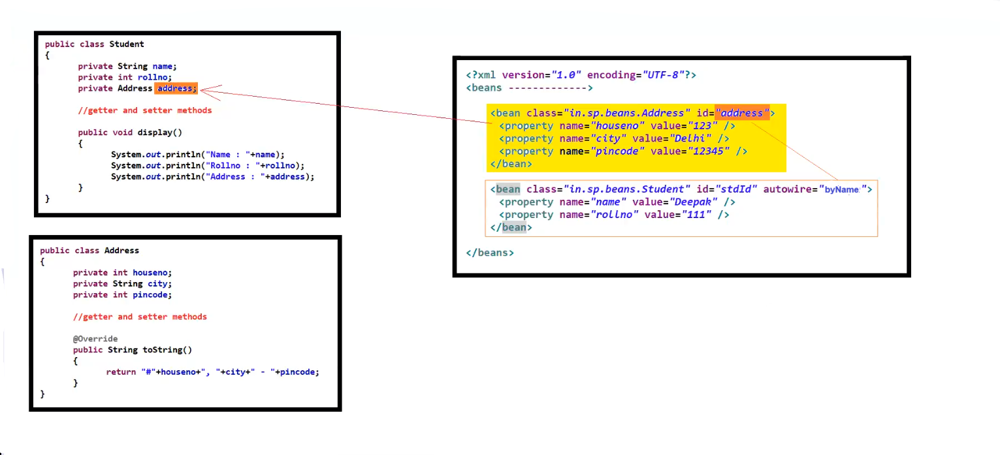
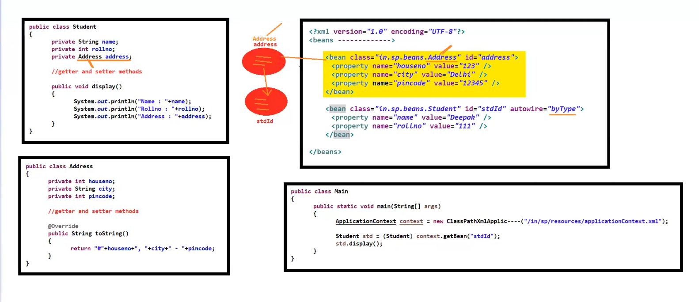
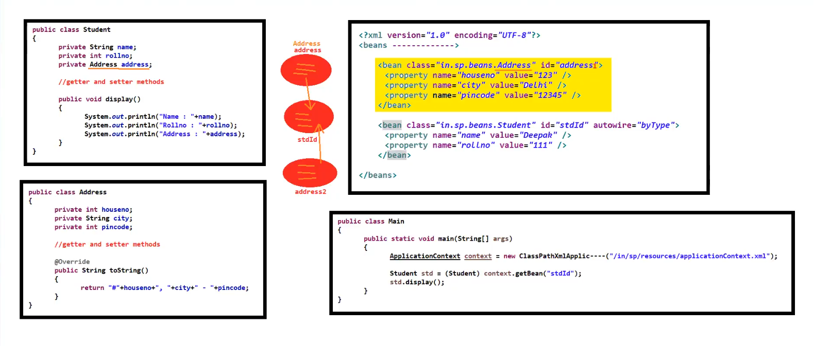

# 🌱 Spring Framework — DI & Autowiring Notes

---

## 💉 Dependency Injection (DI)

> DI is the process by which we can **inject one bean object into another bean object**.

### 🔧 Ways to Achieve DI

DI can be achieved by **2 ways**:

| # | Method | Description |
|---|--------|-------------|
| 1️⃣ | **Setter Method DI** | Injection via setter methods |
| 2️⃣ | **Constructor DI** | Injection via constructor arguments |

> 📝 **Note:** Both methods can be implemented using **XML-based** and **Java-based** configuration.

⚠️ Till now, DI has been achieved by **explicit ways**.

---

## ⚡ Autowiring

> Autowiring is the feature of Spring Framework by which we can achieve **DI automatically**.

### ✅ Advantage
- Requires **less code** to write

### ❌ Disadvantages
- The programmer has **no control** over the injection
- Works **only on non-primitive / user-defined data types** (excluding `String`)
- Does **NOT** work on **primitive data types**

---

### 🛣️ Ways to Achieve Autowiring

Autowiring can be achieved by **4 ways**:

```
1. 📄 XML Based Autowiring
2. 🏷️  Annotation Based Autowiring
3. ☕ Java Based Autowiring
4. 🔍 Component Scanning
```

---

## 📄 XML Based Autowiring

> In XML-based autowiring, we **don't need to use** the `ref` attribute inside `<property>` or `<constructor-arg>` tags.

We use the **`autowire`** attribute in the `<bean>` tag:

```xml
<bean class="----" id="----" autowire="--mode--">
```

---

### 🎛️ Modes of `autowire` Attribute

#### 1️⃣ `no` (Default)
- This is the **default** autowiring mode
- Means: **no autowiring** — we handle DI explicitly

---

#### 2️⃣ `byName`
- Autowiring by matching the **property name** of the bean object with the **bean id** in the Spring config file
- Uses **Setter Method DI** internally

```xml
<!-- Bean id must match the property name in the class -->
<bean class="com.example.Car" id="car" autowire="byName"/>
<bean class="com.example.Engine" id="engine"/>
```


---

#### 3️⃣ `byType`
- Autowiring by matching the **data type** of the property in the bean class with the **class** in `<bean>` tag
- Uses **Setter Method DI** internally

> ⚠️ **Problem:** If multiple beans of the **same type** exist, Spring gets confused about which one to inject!

**🔧 Solution:** Use the `autowire-candidate` attribute:

```xml
<!-- This bean will NOT participate in autowiring -->
<bean class="com.example.Engine" id="engine1" autowire-candidate="false"/>
<bean class="com.example.Engine" id="engine2"/>
```

Setting `autowire-candidate="false"` **excludes** that bean from the autowiring process.





---

#### 4️⃣ `constructor`
- Same as **`byType`** but uses **Constructor DI** internally instead of Setter DI

```xml
<bean class="com.example.Car" id="car" autowire="constructor"/>
```

---

#### 5️⃣ `autodetect` ⚠️ Deprecated
> 🚫 **Deprecated** from **Spring 3.x** onwards — do NOT use this mode in modern Spring applications.

---

## 🗂️ Quick Summary Table

| Mode | Strategy | Internal DI | Notes |
|------|----------|-------------|-------|
| `no` | None | — | Default mode, explicit DI |
| `byName` | Match property name ↔ bean id | Setter DI | Names must match exactly |
| `byType` | Match data type ↔ bean class | Setter DI | Use `autowire-candidate="false"` for conflicts |
| `constructor` | Match data type ↔ bean class | Constructor DI | Same as byType but uses constructor |
| `autodetect` | ~~Auto picks constructor or byType~~ | — | 🚫 Deprecated since Spring 3.x |

---

> 💡 **Key Takeaway:** Autowiring saves boilerplate code but gives up programmer control. Use it wisely, and prefer **Annotation-based** or **Java-based** autowiring in modern Spring applications!