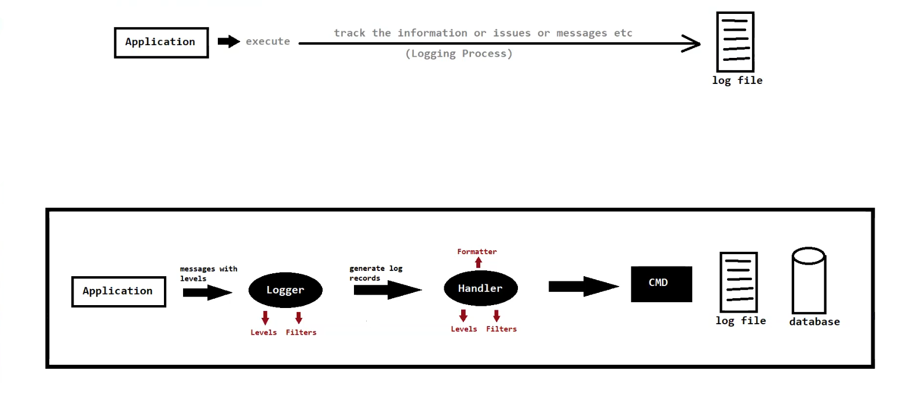

# 📋 Logging in Software Development

## 📌 What is Logging?

> Logging is the process of **tracking or recording** important information, events, messages, or issues that occur during the **execution of our application**.

The log files generated during the logging process help **developers** or **system administrators** to:
- 🔍 Monitor the application behaviour
- 🐛 Diagnose issues
- ❌ Track errors

---

## 🎯 Uses of Logging

| # | Use Case | 📝 Description |
|---|----------|---------------|
| 1️⃣ | 🐞 **Error Tracking & Debugging** | Track errors like those generated during form submission in web apps |
| 2️⃣ | 🔐 **Security Monitoring** | Track failed login attempts or unauthorized access attempts |
| 3️⃣ | 📂 **Auditing & Compliance** | Log all financial transactions including details, time, and location |
| 4️⃣ | ⚡ **Performance Analysis** | Track time taken by the app to perform events or respond |
| 5️⃣ | 🖥️ **System Health Monitoring** | Track memory usage, CPU load, and other metrics in server environments |
| 6️⃣ | 🚀 **Deployment & Release Management** | Track version numbers, time of releasing the application, etc. |

---

## 🌍 Where Can We Use Logging?

```
📦 Logging Applications
├── 💻 Software Development
│   ├── 🌐 Web Development
│   └── 📱 Mobile App Development
│
├── ⚙️ DevOps & Infrastructure
│   ├── 🖥️ Server Applications
│   └── 🗄️ Databases
│
├── 🔒 Networking & Security
│   ├── 🧱 Firewall & Security Appliances
│   └── 🌐 Network Servers
│
├── ☁️ Cloud Computing
│   ├── ☁️ Cloud Servers
│   └── ⚡ Serverless Computing
│
└── 🏭 Industrial Automation & IoT
    ├── 🏗️ Industrial Control Systems
    └── 📡 IoT Devices
```

---

## 🌐 Language Support

Logging is supported by many languages:

`☕ Java` &nbsp;|&nbsp; `🐍 Python` &nbsp;|&nbsp; `🐘 PHP` &nbsp;|&nbsp; `🟨 JavaScript` &nbsp;|&nbsp; `🟢 Node.js` &nbsp;|&nbsp; `...and more!`

---

## 📚 Logging APIs & Frameworks

| # | Framework | Type | Notes |
|---|-----------|------|-------|
| 1️⃣ | ☕ **Java Logging API** | Native API | Built into JDK |
| 2️⃣ | 🪵 **Log4j** | Framework | Popular Apache logging framework |
| 3️⃣ | 🔙 **Logback** | Framework | Successor to Log4j |
| 4️⃣ | 🔬 **Tinylog** | Framework | Lightweight logging framework |
| 5️⃣ | 🎁 **SLF4j** | Wrapper 🔄 | Simple Logging Facade for Java |
| 6️⃣ | 🎁 **JCL** (Jakarta Commons Logging) | Wrapper 🔄 | Old name: Apache Commons Logging |

> 💡 **Note:** SLF4j and JCL are **logging wrappers** — they act as a facade over actual logging frameworks.

---

## 1️⃣ Java Logging API

> 🏷️ Introduced in **JDK 1.4**
> 📦 Package: `java.util.logging`
> ✅ **No external dependency needed** — it's pre-defined in the JDK!

### 🧩 Components of Logging

Java Logging API has **2 main components**:

```
Java Logging API
├── 📢 Logger   → Emits log messages
└── 📬 Handler  → Receives & forwards log messages
```

---

## 📢 Logger

> A **Logger** is an object in the logging framework used to **emit log messages**.

### 📊 Log Levels (Highest → Lowest)

```
🔴  SEVERE   ──── Highest Priority (Critical Errors)
🟠  WARNING  ──── Potential Issues
🔵  INFO     ──── General Information
⚙️  CONFIG   ──── Configuration Messages
🟢  FINE     ──── Detailed Tracing
🟡  FINER    ──── More Detailed Tracing
⚪  FINEST   ──── Lowest Priority (Most Verbose)
```

| Level | Priority | Typical Use |
|-------|----------|-------------|
| 🔴 `SEVERE` | ⬆️ Highest | Critical failures, application crashes |
| 🟠 `WARNING` | ⬆️ High | Unexpected situations, potential problems |
| 🔵 `INFO` | 🔁 Medium | General runtime information |
| ⚙️ `CONFIG` | 🔁 Medium | Configuration-related messages |
| 🟢 `FINE` | ⬇️ Low | Detailed debugging info |
| 🟡 `FINER` | ⬇️ Lower | More detailed debugging info |
| ⚪ `FINEST` | ⬇️ Lowest | Most verbose / fine-grained tracing |

---

## 📬 Handler

> A **Handler** is an object that **listens to messages** at or above a specified minimum log level and **posts them to a target medium** (console, file, database, etc.).

### 🗂️ Types of Handlers

| # | Handler | 📍 Output Destination |
|---|---------|----------------------|
| 1️⃣ | 🖥️ `ConsoleHandler` | Prints logs to the **console** |
| 2️⃣ | 📁 `FileHandler` | Writes logs to a **file** |
| 3️⃣ | 🌊 `StreamHandler` | Writes logs to an **output stream** |
| 4️⃣ | 🔌 `SocketHandler` | Sends logs over a **network socket** |
| 5️⃣ | 💾 `MemoryHandler` | Buffers logs in **memory** |

---

## 🗺️ Logging Flow

```
🖥️ Application Code
        │
        │  calls
        ▼
  📢 Logger (e.g., INFO, WARNING, SEVERE)
        │
        │  passes message to
        ▼
  📬 Handler
  ┌─────┴──────────────────────────┐
  │                                │
  ▼                                ▼
📁 FileHandler              🖥️ ConsoleHandler
  │                                │
  ▼                                ▼
📄 Log File               💻 Console Output
```


---

## 🧠 Quick Summary

| Concept | 🔑 Key Point |
|---------|-------------|
| 📋 Logging | Records events/errors during app execution |
| 📢 Logger | Emits log messages at defined levels |
| 📊 Log Levels | SEVERE → WARNING → INFO → CONFIG → FINE → FINER → FINEST |
| 📬 Handler | Routes log messages to a target medium |
| 5️⃣ Handlers | Console, File, Stream, Socket, Memory |
| ☕ Java Logging API | Built into JDK 1.4+, package: `java.util.logging` |

---

*📝 Notes created for Java Logging concepts*