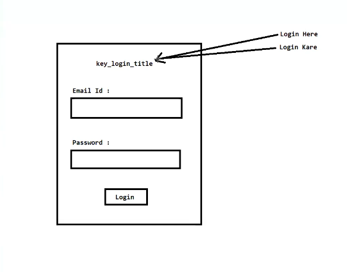

# 🌍 Internationalization & Localization in Java

---

## 🧩 Why Do We Need It?

Whenever we create an application, we want to execute it for **different countries** having different:

- 🗣️ Languages
- 🕐 Time Zones
- 🎭 Cultures

---

## 📦 Data That Differs Across Countries

| 🔢 Type         | 📌 Example                        |
|----------------|-----------------------------------|
| 🔢 Number       | `1,000.00` vs `1.000,00`          |
| 💰 Currency     | `$100` vs `₹100` vs `€100`        |
| 📅 Date         | `MM/DD/YYYY` vs `DD/MM/YYYY`      |
| ⏰ Time         | `12-hour` vs `24-hour`            |
| 💬 Messages     | `"Hello"` vs `"नमस्ते"` vs `"Hola"` |
| 📞 Phone Numbers| `+1-800-555-0199` vs `+91-98XXXXXXXX` |
| 🏠 Address      | Different formats per country     |
| ...and more!   |                                   |

---

## 🌐 Internationalization (I18N)

> **"I18N"** → 18 letters between **I** and **N** in "Internationalization"

### 📖 Definition
Internationalization means **designing and creating** a web or software application in such a way that makes it **easy to adapt** for people of different countries or cultures.

### 🏗️ Think of it as...
> *"Building a strong foundation 🧱 that can later be customized to fit the preferences and languages of different countries."*

### ✅ Key Points
- 🔧 Done by **developers** at the design/architecture level
- 🌱 Done **once** — lays the groundwork for all locales
- 🧩 Separates **content** from **code**
- 📐 Makes the app **locale-aware** without hardcoding values

---

## 🗺️ Localization (L10N)

> **"L10N"** → 10 letters between **L** and **N** in "Localization"

### 📖 Definition
Localization means **taking the I18N foundation** and customizing it for a **specific region, language, or culture**.

### 🎨 Think of it as...
> *"Decorating 🎨 and furnishing the foundation built by I18N for a specific country or culture."*

### ✅ Key Points
- 🌍 Done for **each specific locale/region**
- 🔁 Done **multiple times** — once per target locale
- 📝 Involves translating text, formatting numbers/dates/currencies
- 👥 Often done by **translators and cultural consultants**

---
---

---
## 🔄 I18N vs L10N — Quick Comparison

| Feature            | 🌐 I18N                        | 🗺️ L10N                          |
|--------------------|-------------------------------|----------------------------------|
| Full Name          | Internationalization          | Localization                     |
| Abbreviation       | I18N                          | L10N                             |
| Done By            | Developers                    | Translators / Developers         |
| Done               | Once                          | Per locale                       |
| Focus              | Architecture & Design         | Content & Formatting             |
| Goal               | Make app adaptable            | Adapt app for specific locale    |

---

## ☕ Java's Built-in I18N & L10N Classes

Java provides pre-defined classes to achieve I18N & L10N:

---

### 1️⃣ `Locale` 🌏
- Represents a **specific geographical, political, or cultural region**
- Acts as the **backbone** of all I18N operations in Java
- Example: `Locale.US`, `Locale.FRANCE`, `new Locale("hi", "IN")`

```java
Locale locale = new Locale("en", "US");  // English - United States
Locale locale = Locale.FRANCE;           // French - France
```

---

### 2️⃣ `NumberFormat` 🔢
- Formats **numbers and currencies** according to a locale
- Subclass: **`DecimalFormat`** — for custom number patterns

```java
NumberFormat nf = NumberFormat.getInstance(Locale.US);
nf.format(123456.789);  // → "123,456.789"

NumberFormat cf = NumberFormat.getCurrencyInstance(Locale.FRANCE);
cf.format(1999.99);     // → "1 999,99 €"
```

---

### 3️⃣ `DateFormat` 📅
- Formats **dates and times** according to a locale
- Subclass: **`SimpleDateFormat`** — for custom date/time patterns

```java
DateFormat df = DateFormat.getDateInstance(DateFormat.LONG, Locale.US);
df.format(new Date());  // → "April 4, 2026"

SimpleDateFormat sdf = new SimpleDateFormat("dd/MM/yyyy", new Locale("en", "IN"));
sdf.format(new Date()); // → "04/04/2026"
```

---

### 4️⃣ `ResourceBundle` 💬
- Loads **locale-specific resources** (like messages/labels) from `.properties` files
- Enables **externalized text** — no hardcoding of strings!

```java
// messages_en.properties → greeting=Hello!
// messages_fr.properties → greeting=Bonjour!
// messages_hi.properties → greeting=नमस्ते!

ResourceBundle rb = ResourceBundle.getBundle("messages", Locale.FRANCE);
rb.getString("greeting");  // → "Bonjour!"
```

---

## 🗂️ Summary Flow

```
        ┌──────────────────────────────────┐
        │        Your Java Application     │
        └──────────────┬───────────────────┘
                       │
            🌐 Internationalization (I18N)
                       │
         ┌─────────────▼─────────────────┐
         │  Locale-aware Code Structure  │
         │  (NumberFormat, DateFormat,   │
         │   ResourceBundle, etc.)       │
         └──────┬───────────┬────────────┘
                │           │
     🗺️ L10N    │          │   🗺️ L10N
                │           │
        ┌───────▼──┐   ┌────▼─────┐
        │  🇺🇸 en_US │  │  🇫🇷 fr_FR │  ...and more!
        └──────────┘   └──────────┘
```

---

## 📌 Quick Reference — Abbreviations

| Term                   | Abbr   | Why?                                      |
|------------------------|--------|-------------------------------------------|
| Internationalization   | I18N   | 18 chars between first **I** and last **N** |
| Localization           | L10N   | 10 chars between first **L** and last **N** |

---

> 💡 **Pro Tip:** Always design with I18N in mind **from the start** — retrofitting it later is expensive and error-prone!