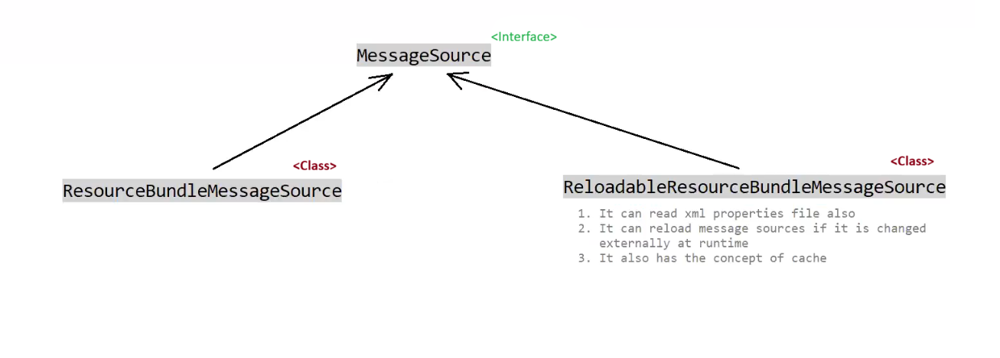

# 🌍 I18N and L10N in Spring

---

## 📖 What are I18N and L10N?

| Term | Full Form | Meaning |
|------|-----------|---------|
| **I18N** | Internationalization | Designing an app to support multiple languages/regions |
| **L10N** | Localization | Adapting the app for a specific language/region |

> 💡 **I18N** = Making your app *ready* for multiple languages.
> 🎯 **L10N** = Actually *translating/adapting* it for a specific locale.

---

## 🛠️ Key Classes & Interfaces in Spring

To achieve I18N and L10N in Spring, we use the following:

```
1. MessageSource              <interface>
2. ResourceBundleMessageSource        <class>
3. ReloadableResourceBundleMessageSource  <class>
```

---



---

## 1️⃣ `MessageSource` — Interface

📌 **Package:** `org.springframework.context`

The **core interface** for resolving messages, supporting I18N.

### 🔑 Key Method:
```java
String getMessage(String code, Object[] args, String defaultMessage, Locale locale);
```

### ✅ Responsibilities:
- 🔍 Look up messages by **code/key**
- 🌐 Support **Locale-based** message resolution
- 💬 Accept **arguments** for dynamic messages
- 🛡️ Return a **default message** if key not found

---

## 2️⃣ `ResourceBundleMessageSource` — Class

📌 **Package:** `org.springframework.context.support`
📌 **Implements:** `MessageSource`

Loads messages from **`.properties` files** on the **classpath** using Java's `ResourceBundle`.

### ⚙️ Configuration (Java-based):
```java
@Bean
public MessageSource messageSource() {
    ResourceBundleMessageSource messageSource = new ResourceBundleMessageSource();
    messageSource.setBasename("messages");       // 📁 looks for messages.properties
    messageSource.setDefaultEncoding("UTF-8");   // 🔤 encoding
    return messageSource;
}
```

### 📁 Properties Files:
```
messages.properties          ← default (fallback)
messages_en.properties       ← English 🇬🇧
messages_hi.properties       ← Hindi 🇮🇳
messages_fr.properties       ← French 🇫🇷
```

### 📝 Example `messages_en.properties`:
```properties
greeting=Hello, {0}!
farewell=Goodbye!
```

### 📝 Example `messages_hi.properties`:
```properties
greeting=नमस्ते, {0}!
farewell=अलविदा!
```

### ✅ Features:
- ✔️ Simple and lightweight
- ✔️ Uses standard Java `ResourceBundle`
- ❌ Does **NOT** support hot-reloading (requires restart to pick up changes)
- ❌ Only loads from **classpath**

---

## 3️⃣ `ReloadableResourceBundleMessageSource` — Class

📌 **Package:** `org.springframework.context.support`
📌 **Implements:** `MessageSource`

An **enhanced version** of `ResourceBundleMessageSource` that supports **hot-reloading** of properties files — no restart needed! 🔄

### ⚙️ Configuration (Java-based):
```java
@Bean
public MessageSource messageSource() {
    ReloadableResourceBundleMessageSource messageSource =
        new ReloadableResourceBundleMessageSource();
    messageSource.setBasename("classpath:messages");  // 📁 file location
    messageSource.setDefaultEncoding("UTF-8");        // 🔤 encoding
    messageSource.setCacheSeconds(3600);              // ⏱️ reload every 1 hour
    return messageSource;
}
```

### ✅ Features:
- ✔️ Supports **hot-reloading** (set `cacheSeconds`)
- ✔️ Can load files from **classpath AND file system**
- ✔️ More **flexible** than `ResourceBundleMessageSource`
- ✔️ Uses Spring's own resource loading (not Java's `ResourceBundle`)
- ✔️ Better for **production environments**

---

## ⚖️ Comparison Table

| Feature | `ResourceBundleMessageSource` | `ReloadableResourceBundleMessageSource` |
|---------|-------------------------------|----------------------------------------|
| 🔄 Hot Reload | ❌ No | ✅ Yes |
| 📂 File Location | Classpath only | Classpath + File System |
| 🏗️ Based On | Java `ResourceBundle` | Spring Resource Loading |
| ⚡ Performance | Slightly faster | Slightly slower (checks for changes) |
| 🏭 Best For | Simple apps / dev | Production / dynamic updates |

---

## 💻 Usage Example in a Controller

```java
@Autowired
private MessageSource messageSource;

public String greetUser(Locale locale) {
    // 🌍 Resolves message based on user's locale
    return messageSource.getMessage("greeting", new Object[]{"Ravi"}, locale);
}
```

### 🖨️ Output:
- 🇬🇧 English → `Hello, Ravi!`
- 🇮🇳 Hindi → `नमस्ते, Ravi!`
- 🇫🇷 French → `Bonjour, Ravi!`

---

## 🧠 Quick Revision

```
🌍 I18N  →  Internationalization  →  Make app multi-language ready
🎯 L10N  →  Localization          →  Adapt for specific region

📌 MessageSource              →  Interface (core contract)
📌 ResourceBundleMessageSource →  Class (classpath, no hot-reload)
📌 ReloadableResourceBundle... →  Class (flexible, hot-reload ✅)
```

---

> 🚀 **Pro Tip:** Always prefer `ReloadableResourceBundleMessageSource` in production for flexibility and zero-downtime message updates!