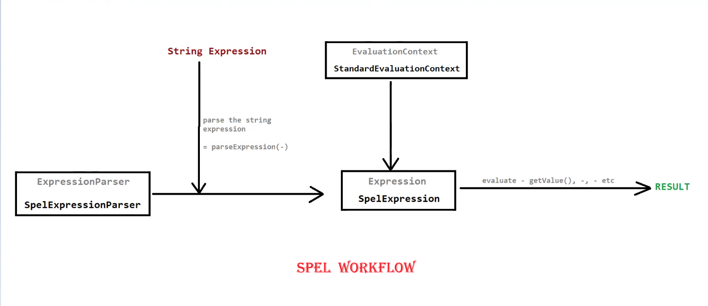

# 🌱 Spring Expression Language (SpEL) Notes

---

## 📌 What is SpEL?

> **SpEL** stands for **Spring Expression Language**

- 🔤 SpEL is an **Expression Language** that allows you to **define and evaluate expressions at runtime**.

---

## ✨ Features Supported by SpEL

---

### 1️⃣ Operators

#### ➕ Arithmetic Operators
| Symbol | Operation |
|--------|-----------|
| `+` | Addition |
| `-` | Subtraction |
| `*` | Multiplication |
| `/` | Division |
| `%` | Modulus |

---

#### 🔁 Relational Operators
| Symbol | Alternative | Meaning |
|--------|-------------|---------|
| `==` | `eq` | Equal to |
| `!=` | `ne` | Not equal to |
| `>` | `gt` | Greater than |
| `<` | `lt` | Less than |
| `>=` | `ge` | Greater than or equal to |
| `<=` | `le` | Less than or equal to |

---

#### 🧠 Logical Operators
| Symbol | Alternative | Meaning |
|--------|-------------|---------|
| `&&` | `and` | Logical AND |
| `\|\|` | `or` | Logical OR |
| `!` | `not` | Logical NOT |

---

#### ❓ Ternary Operator
```
variable = conditional-expression ? expression1 : expression2
```

---

#### 🏷️ Type Operator
```
T(ClassName)
```

---

### 2️⃣ Expressions

| 🔖 Type | Description |
|---------|-------------|
| 📝 Literal Expressions | Plain values like strings, numbers, booleans |
| 📞 Method Invocation | Calling methods on objects |
| 🏗️ Constructor Invocation | Creating new objects |
| 🔍 Regular Expressions (RegEx) | Pattern matching |
| 🏛️ Class Expressions | Accessing class-level information |
| 📐 Templated Expressions | Mix of literal text and expressions |

---

### 3️⃣ 📦 Accessing Collections

- ✅ Arrays
- ✅ Lists
- ✅ Maps
- ✅ and more...

---

### 4️⃣ 🫘 Bean References

- Allows referencing Spring Beans within expressions.

---

## 🛠️ How to Use SpEL?

SpEL can be used in **2 ways**:

```
1. 🖥️  Using pre-defined interfaces and classes
2. 💬  #{expression}  ← annotation-based syntax
```

---

## 🏛️ Pre-defined Interfaces & Classes in SpEL

> 📦 All of these are present in the package:
> **`org.springframework.expression`**

---

### 🔵 Interfaces

#### 1. `ExpressionParser` *(interface)*
- 🎯 Responsible to **parse (resolve)** a string expression.
- 📋 **Method:**
  - `parseExpression(-)`

---

#### 2. `Expression` *(interface)*
- 🎯 Responsible to **evaluate** the string expression.
- 📋 **Methods:**
  - `getValue(-)`
  - `getValueType()`
  - `getValueTypeDescriptor()`
  - `getExpressionString()`
  - *...and more*

---

#### 3. `EvaluationContext` *(interface)*
- 🎯 Responsible for providing the **context** in which expressions are evaluated.
- 🔄 Holds **variables**, **functions**, and other contextual information required for evaluating a SpEL expression.

---

### 🟢 Implementation Classes

| 🔵 Interface | 🟢 Implementing Class |
|--------------|----------------------|
| `ExpressionParser` | `SpelExpressionParser` |
| `Expression` | `SpelExpression` |
| `EvaluationContext` | `StandardEvaluationContext` |

---

## 🧩 Quick Reference Summary

```
ExpressionParser       →  parses a string into an expression
SpelExpressionParser   →  concrete implementation of ExpressionParser

Expression             →  evaluates the parsed expression
SpelExpression         →  concrete implementation of Expression

EvaluationContext      →  provides context (vars, functions) for evaluation
StandardEvaluationContext → concrete implementation of EvaluationContext
```

---

> 💡 **Tip:** SpEL is most commonly used with the `#{}` syntax in Spring annotations like `@Value`, `@ConditionalOnExpression`, and in Spring Security's `@PreAuthorize`.

---

---
### ✨ SpEL Workflow:-



---
*📚 Notes SpEL*