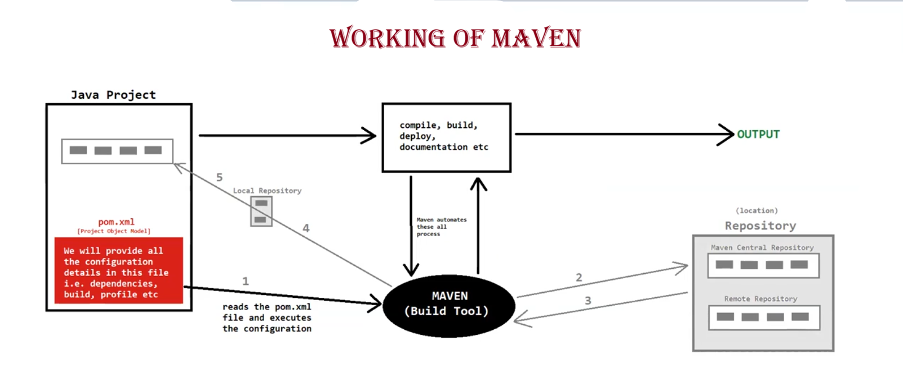
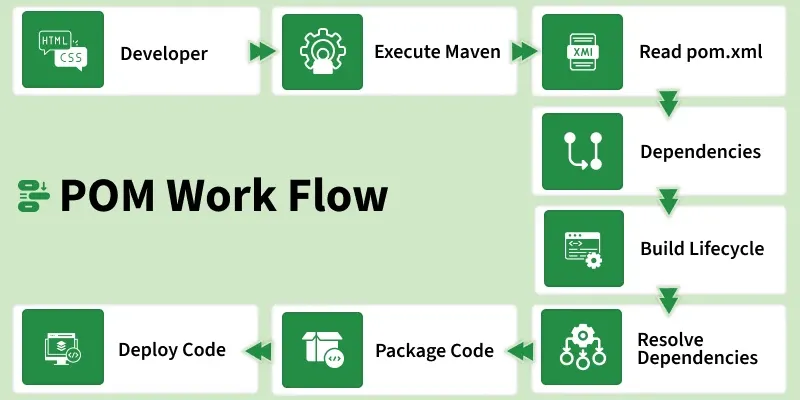

# ☕ Maven — Complete Notes

---

## 🔨 What is Maven?

- 🚀 Maven is a powerful open-source **Project Automation Build Tool** — it automates everything related to building a project.
- 👨‍💻 Developed by **Jason van Zyl**, initially released in **July 2004**.
- 🏛️ Founded as the **Apache Maven Project** (Jakarta Turbine Project), later taken over by the **Apache Software Foundation**.
- ☕ Written in **Java** — JVM must be installed to work with Maven.
- 🌐 Primarily used with Java projects but also supports other JVM-based technologies: **Scala, Groovy, Kotlin**, etc.

### 🛠️ Other Build Tools
| Tool | Supported Technologies |
|------|----------------------|
| **Ant** | Java, JVM, C/C++, JavaScript |
| **Gradle** | Java, JVM, Android, Kotlin, C/C++ |

---



---

## ✅ What Can Maven Do?

1. 📁 Creates the default project structure
2. 📦 Downloads required dependencies (JAR files)
3. 📝 Prepares the documentation
4. ⚙️ Compiles the source code
5. 🗜️ Packages the project into JAR / WAR / EAR files
6. 🖥️ Installs the packaged code on the server
7. ▶️ Starts and stops the server
8. 🏗️ Builds and deploys the project
9. 🧪 Performs test execution
10. 📊 Generates test reports

---

## 🌟 Advantages / Objectives of Maven

1. ✔️ Makes the build process easy
2. ⚡ Enhances project performance
3. 🔄 Easy to migrate to newer or older versions
4. 🛡️ Strong error and integrity reporting
5. 🔗 Integrates with **Version Control Systems** (e.g., Git)

---

## 🧠 Working of Maven

> 📌 **NOTE:** Maven is controlled by the `pom.xml` file.

---

## ❤️ POM (Project Object Model)

- 📄 An XML file (`pom.xml`) containing project info and configuration details used by Maven to build the project.
- 💖 Also known as the **"heart" of Maven**.
- 🕰️ In **Maven 1**, it was called `project.xml`; from **Maven 2** onwards, renamed to `pom.xml`.

### 📋 POM Structure

```xml
<?xml version="--" encoding="--" ?>

<project ...>

    <!-- 1. 📌 Project Information      -->
    <!-- 2. 🔀 SCM (Source Control Mgmt) -->
    <!-- 3. ⚙️  Properties               -->
    <!-- 4. 📦 Dependencies              -->
    <!-- 5. 🏗️  Build Settings           -->
    <!-- 6. 🔌 Plugins & Goals           -->
    <!-- 7. 🗄️  Repositories             -->
    <!-- 8. 📊 Reporting                 -->
    <!-- 9. 👤 Profiles                  -->

</project>
```
---



---

## 📌 Project Information

Contains project details like version, groupId, artifactId, name, URL, etc.

```xml
<modelVersion>4.0.0</modelVersion>

<groupId>com.example</groupId>
<artifactId>my-project</artifactId>
<version>1.0.0</version>

<name>My Project</name>
<description>A sample Maven project</description>
<url>https://github.com/example/my-project</url>
```

---

## ⚙️ Property References

Provides flexibility to avoid hardcoded values (e.g., version numbers).

```xml
<properties>
    <java.version>1.8</java.version>
</properties>

<dependencies>
    <dependency>
        <!-- ... -->
        <version>${java.version}</version>
    </dependency>
</dependencies>
```

---

## 📦 Dependencies

- Dependencies are **JAR files / libraries** required by the project.
- Maven **automatically downloads** them — no manual jar management needed! 🎉

```xml
<dependencies>
    <dependency>
        <groupId>junit</groupId>
        <artifactId>junit</artifactId>
        <version>4.11</version>
        <scope>test</scope>
    </dependency>

    <dependency>
        <groupId>mysql</groupId>
        <artifactId>mysql-connector-java</artifactId>
        <version>8.0.28</version>
    </dependency>
</dependencies>
```

---

## 🗄️ Repositories

The location (server or local) from where Maven downloads dependencies.

### 3 Types of Repositories

| # | Type | Description | Path |
|---|------|-------------|------|
| 1️⃣ | **Local Repository** | Stored on your own system | `C:\Users\PC-Name\.m2\repository` |
| 2️⃣ | **Central Repository** | Default public online repo | `https://repo.maven.apache.org/maven2/` |
| 3️⃣ | **Remote Repository** | Private org repository | `https://organizationname.com/----` |

> 💡 **Tip:** When Maven downloads from the Central Repository, it also caches it in the Local Repository for future use!

```xml
<repositories>
    <repository>
        <id> ---- </id>
        <name> ---- </name>
        <url> ---- </url>
    </repository>
</repositories>
```

---

## 🤔 Build vs Deploy vs Release

| Term | Meaning |
|------|---------|
| 🏗️ **Build** | Converting source code into an executable/binary version (compile → link → package → test → docs) |
| 🚀 **Deploy** | Installing the application on an environment (e.g., a server) |
| 🎉 **Release** | Making the application available to end-users |

---

## 🔧 Build Configurations

Contains the configuration of the build lifecycle. Two types:

### 1. 🔌 Plugin Configuration

Maven is a **collection of plugins** that perform tasks like:
- Creating JAR / WAR / EAR files
- Compiling code
- Running unit tests
- Generating documentation & reports

Maven uses an internal **"Maven Plugin Execution Framework"** for this.

#### Two Types of Plugins:

| Type | Purpose | Tag |
|------|---------|-----|
| 🏗️ **Build Plugin** | Executed during build (clean, compile, deploy, install) | `<plugins>` / `<plugin>` |
| 📊 **Reporting Plugin** | Executed during reporting phases (issue tracking, team info) | `<reporting>` |

---

### 2. 📂 Resource Configuration

- The **resource plugin** copies files from input → output resource directory.
- By default, Maven looks for resources under `src/main/resources`.
- Custom directories can be specified if resources are elsewhere.

```xml
<resources>
    <resource>
        <directory> src/xyz </directory>
    </resource>
</resources>
```

---

> 📝 *Notes prepared on Apache Maven — Build Automation Tool*