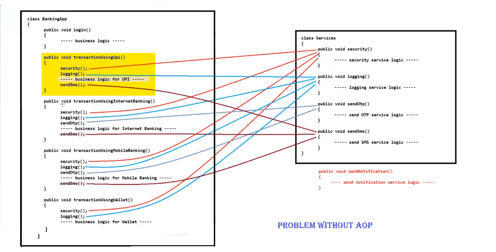
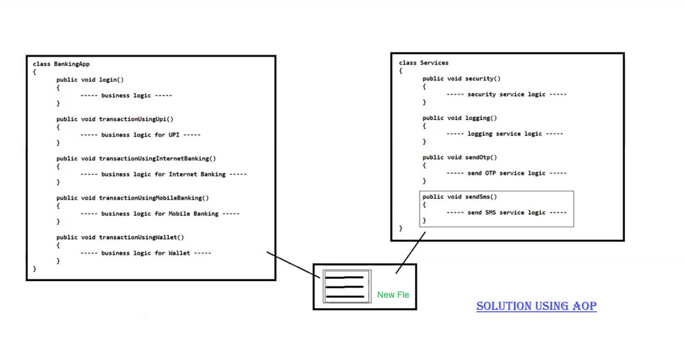

# 🌱 Spring AOP Module Notes

---

## 🤔 What is AOP?

- **AOP** stands for **Aspect Oriented Programming**
- It is a **Programming Paradigm / Approach** that focuses on modularization and managing **cross-cutting concerns** in software development
- AOP is implemented in many languages: Java, Python, PHP, C++, etc.
- Unlike **OOP** (which focuses on classes & objects), AOP focuses more on **Aspects**

---

## ❓ Why Do We Need AOP?

### 🏦 Scenario
Create a banking application with multiple transactions — UPI, Internet Banking, Mobile Banking, Wallet — along with security, logging, OTP, SMS, etc.





### 😟 Problem (with OOP)
- Business logic methods get cluttered with unrelated code (security, logging, etc.)
- Changing any service logic becomes difficult to maintain across the project
- Code becomes messy and hard to read

### ✅ Solution → Use AOP!
AOP **complements OOP** to achieve clearer and better modularity.

---

## 🌟 Advantages of AOP

| # | Advantage |
|---|-----------|
| 1️⃣ | Provides **more modularity** |
| 2️⃣ | Improves **maintainability** and **readability** of code |
| 3️⃣ | Provides **loosely coupled** design |

---

## 📚 Key Terms in AOP

### 1. 🧩 Aspect
- A module/concept that encapsulates a specific **cross-cutting concern** (e.g., security, logging, transactions, error handling)
- Provides services that can be applied to **multiple parts** of an application

### 2. ✂️ Cross-Cutting Concerns
- Functionality/requirements (logging, security, transactions, error handling) that **affect multiple parts** of the codebase

### 3. 💡 Advice
- The **actual code** that implements a specific aspect's behaviour
- Runs at designated **join-points** to achieve the cross-cutting concern

#### 📌 Examples:
- **Logging** → Java Logging API, Log4j, Tinylog
- **Security** → JAAS (Java Authentication and Authorization Service)
- **Transactions** → JTA (Java Transaction API)

---

## 🔔 Types of Advice (5 Types)

| # | Type | ⏰ When it Runs | 💼 Use Case |
|---|------|----------------|-------------|
| 1️⃣ | **Before Advice** | Before target method execution | Input validation, setup operations |
| 2️⃣ | **After Advice** | After target method execution (any outcome) | Cleanup tasks, post-logic actions |
| 3️⃣ | **After Returning Advice** | After successful execution (no exception) | Actions on successful completion |
| 4️⃣ | **After Throwing Advice** | After target method throws an exception | Error handling, logging errors, recovery |
| 5️⃣ | **Around Advice** | Before AND after method execution | Manipulation before & after execution |

---

## 📍 Join-Points
- A **location** in the application where an aspect/advice **can be applied**
- Can be before/after a method execution, before throwing an exception, or before/after modifying an instance variable

## 🎯 Pointcuts
- The **specific join-point** where the aspect/advice is actually **plugged in and implemented**

## 🎯 Target
- The specific components (methods or classes) where we **want to apply the advice**

## 🛡️ Proxy
- An object that **contains the target object** and **advice (advisor) details**

## 🤝 Advisor
- A group of **Advice + Pointcut** that is passed to the **Proxy Factory Object**

## 🧵 Weaving
- The process of **applying the aspect on the target object** to generate a proxy

### ⏱️ Weaving can happen at:
- 🔨 **Compile time**
- 📦 **Load time**
- ▶️ **Runtime**

> 📝 **NOTE:** Spring AOP performs weaving at **Runtime**

---

## 🗺️ AOP Flow Diagram

```
Business Logic Method
        |
        v
   [ Proxy Object ]
   ┌─────────────────────────────────┐
   │  🔹 Before Advice               │
   │  🔹 Target Method Execution     │
   │  🔹 After Advice                │
   │  🔹 After Returning / Throwing  │
   └─────────────────────────────────┘
        |
        v
     Result / Exception
```

---

*📌 Spring AOP = Cleaner Code + Better Modularity + Loosely Coupled Design* 🚀