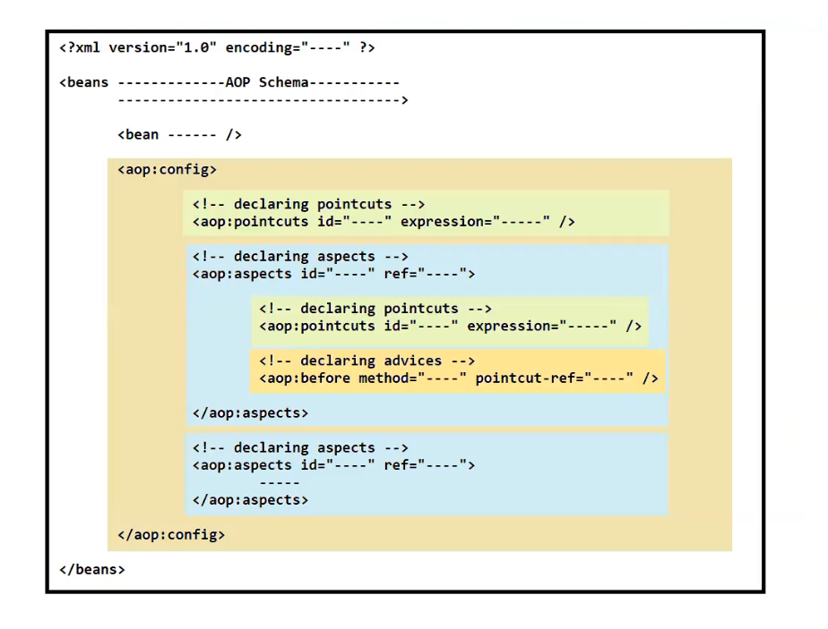

# 🌱 Spring AOP — XML Configuration (XSD Based)

---

## 📌 Overview

> In this approach, we use **namespace tags** to declare aspects, advices, and pointcuts in the Spring XML configuration file.

---

## 🏗️ Parent Namespace Tag

```xml
<aop:config>
    <!-- All AOP configurations go here -->
    <!-- Aspects, Advices, Pointcuts -->
</aop:config>
```

- 🔑 `<aop:config>` is the **main (parent) tag**
- ✅ All aspects, advices, and pointcuts are placed **inside** this tag
- ⚙️ To use `<aop:config>`, you must include the **AOP Schema** in your `spring.xml` file

---

## 🗂️ AOP Schema Declaration (spring.xml)

```xml
<beans xmlns="http://www.springframework.org/schema/beans"
       xmlns:aop="http://www.springframework.org/schema/aop"
       xsi:schemaLocation="
           http://www.springframework.org/schema/beans
           http://www.springframework.org/schema/beans/spring-beans.xsd
           http://www.springframework.org/schema/aop
           http://www.springframework.org/schema/aop/spring-aop.xsd">
</beans>
```

---



---

## 🎯 What is an Expression?

> An **expression** is the way to describe **pointcuts programmatically**.

### 📐 Syntax

```xml
expression = "execution(----define expression----)"
```

### 🧩 Pointcut Designators (POD)

You must provide **Pointcut Designators (POD)** in the expression:

| POD | Description |
|-----|-------------|
| `execution` | Matches method execution join points |
| `within` | Matches join points within certain types |
| `this` | Matches join points where the bean reference is an instance of the given type |
| `bean` | Matches join points on a named Spring bean |

---

## 🔎 POD `execution` — Syntax Examples

```java
// 1️⃣ Matches all no-arg methods in BankTransaction class
execution(* in.sp.services.BankTransaction.*())

// 2️⃣ Matches all methods with any number of arguments
execution(* in.sp.services.BankTransaction.*(..))

// 3️⃣ Matches methods where first arg is String, followed by any args
execution(* in.sp.services.BankTransaction.*(String, ..))

// 4️⃣ Matches ALL methods in ALL classes with any arguments (wildcard)
execution(* *(..))
```

| Pattern | Meaning |
|---------|---------|
| `*` | Any return type |
| `*()` | No arguments |
| `*(..)` | Any number of arguments |
| `*(String, ..)` | First arg is String, rest can be anything |

---

## 🛡️ Types of Advices

Spring AOP provides **5 types of advice tags**:

---

### 1️⃣ `<aop:before>` — Before Advice

> ▶️ Executes **before** the target method runs.

```xml
<aop:config>
    <aop:aspect ref="loggingAspect">
        <aop:before method="logBefore"
                    pointcut="execution(* in.sp.services.BankTransaction.*(..))" />
    </aop:aspect>
</aop:config>
```

- 🔔 Runs **prior** to the method execution
- ❌ Cannot prevent method execution (unless it throws an exception)

---

### 2️⃣ `<aop:after>` — After (Finally) Advice

> 🔚 Executes **after** the target method runs — whether it succeeds or throws an exception.

```xml
<aop:after method="logAfter"
           pointcut="execution(* in.sp.services.BankTransaction.*(..))" />
```

- ✅ Works like a **finally block**
- 🔄 Runs regardless of method outcome

---

### 3️⃣ `<aop:after-returning>` — After Returning Advice

> ✅ Executes **only if** the target method **returns successfully** (no exception).

```xml
<aop:after-returning method="logAfterReturning"
                     returning="result"
                     pointcut="execution(* in.sp.services.BankTransaction.*(..))" />
```

- 📦 Can access the **return value** using the `returning` attribute
- ❌ Does **not** execute if an exception is thrown

---

### 4️⃣ `<aop:after-throwing>` — After Throwing Advice

> ❌ Executes **only if** the target method **throws an exception**.

```xml
<aop:after-throwing method="logAfterThrowing"
                    throwing="ex"
                    pointcut="execution(* in.sp.services.BankTransaction.*(..))" />
```

- 🚨 Can access the **exception object** using the `throwing` attribute
- ✅ Does **not** execute on successful return

---

### 5️⃣ `<aop:around>` — Around Advice

> 🔁 The most **powerful** advice — wraps around the entire method execution.

```xml
<aop:around method="logAround"
            pointcut="execution(* in.sp.services.BankTransaction.*(..))" />
```

```java
// In the Aspect class:
public Object logAround(ProceedingJoinPoint pjp) throws Throwable {
    System.out.println("⏩ Before method");
    Object result = pjp.proceed(); // 👈 Actually invokes the target method
    System.out.println("⏪ After method");
    return result;
}
```

- ⚡ Can execute logic **before AND after** the method
- 🛑 Can **prevent** the method from executing entirely
- 🔄 Must call `pjp.proceed()` to invoke the actual method
- 🔧 Uses `ProceedingJoinPoint` (not just `JoinPoint`)

---

## 📊 Advice Comparison Table

| Advice Type | Runs When | Can Stop Execution | Access Return Value | Access Exception |
|---|---|---|---|---|
| `<aop:before>` | Before method | ❌ No | ❌ No | ❌ No |
| `<aop:after>` | Always (finally) | ❌ No | ❌ No | ❌ No |
| `<aop:after-returning>` | On success only | ❌ No | ✅ Yes | ❌ No |
| `<aop:after-throwing>` | On exception only | ❌ No | ❌ No | ✅ Yes |
| `<aop:around>` | Before & After | ✅ Yes | ✅ Yes | ✅ Yes |

---

## 🗃️ Full Configuration Example

```xml
<aop:config>

    <!-- 🎯 Reusable Pointcut -->
    <aop:pointcut id="bankMethods"
                  expression="execution(* in.sp.services.BankTransaction.*(..))" />

    <!-- 🧩 Aspect -->
    <aop:aspect ref="loggingAspect">

        <!-- 1️⃣ Before -->
        <aop:before method="logBefore" pointcut-ref="bankMethods" />

        <!-- 2️⃣ After -->
        <aop:after method="logAfter" pointcut-ref="bankMethods" />

        <!-- 3️⃣ After Returning -->
        <aop:after-returning method="logAfterReturning"
                             returning="result"
                             pointcut-ref="bankMethods" />

        <!-- 4️⃣ After Throwing -->
        <aop:after-throwing method="logAfterThrowing"
                            throwing="ex"
                            pointcut-ref="bankMethods" />

        <!-- 5️⃣ Around -->
        <aop:around method="logAround" pointcut-ref="bankMethods" />

    </aop:aspect>

</aop:config>
```

---

## 💡 Key Takeaways

- 🏛️ `<aop:config>` is the **root container** for all AOP XML config
- 🎯 **Expressions** define *where* (which methods) advice applies
- 🧩 **POD** (`execution`, `within`, `this`, `bean`) defines the matching strategy
- 🛡️ **5 advice types** cover every scenario: before, after, success, failure, and full control
- 🔁 `<aop:around>` is the most powerful but requires explicit `pjp.proceed()` call

---

*📝 Notes on Spring AOP — XML Configuration (XSD Based)*