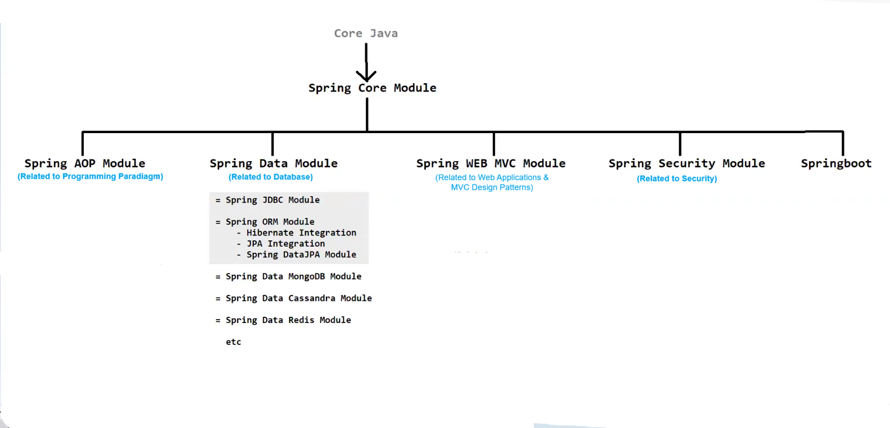

# 🗄️ Database — Short Notes

---

## 📌 What is a Database?

- 📂 A **database** is an **organized collection of structured information or data**
- 💻 It is typically stored **electronically** in a computer system
- 🔒 Usually controlled by a **Database Management System (DBMS)**

---

## ⚙️ What is DBMS?

> 🛠️ A **Database Management System (DBMS)** is software that manages and controls a database.

---

## 🏆 Popular DBMS Examples
# 🗄️ Database — Short Notes

---

## 📌 What is a Database?

- 📂 A **database** is an **organized collection of structured information or data**
- 💻 It is typically stored **electronically** in a computer system
- 🔒 Usually controlled by a **Database Management System (DBMS)**

---

## ⚙️ What is DBMS?

> 🛠️ A **Database Management System (DBMS)** is software that manages and controls a database.

---

## 🏆 Popular DBMS Examples

| # | DBMS | Type |
|---|------|------|
| 1 | 🐬 **MySQL** | Relational |
| 2 | 🪟 **Microsoft SQL Server** | Relational |
| 3 | 🐘 **PostgreSQL** | Relational |
| 4 | 🪶 **SQLite** | Relational (Lightweight) |
| 5 | 🍃 **MongoDB** | NoSQL (Document) |
| 6 | 💎 **Cassandra** | NoSQL (Wide-column) |
| 7 | 🔵 **DB2** | Relational |

---

## 🔤 Query Languages

- 📝 To **store, retrieve, and manage** data in a database, we use **Query Languages**
- 🔹 Examples:
  - **SQL** (Structured Query Language) — most widely used
  - **Oracle** — used with Oracle DB

---

## 🧠 Quick Recap

| Term | Meaning |
|------|---------|
| 🗄️ Database | Organized collection of structured data |
| ⚙️ DBMS | Software to manage the database |
| 🔤 Query Language | Language used to interact with the database |

---

> 💡 *"Data is the new oil — and a Database is the refinery!"*

| # | DBMS | Type |

|---|------|------|

| 1 | 🐬 **MySQL** | Relational |

| 2 | 🪟 **Microsoft SQL Server** | Relational |

| 3 | 🐘 **PostgreSQL** | Relational |

| 4 | 🪶 **SQLite** | Relational (Lightweight) |

| 5 | 🍃 **MongoDB** | NoSQL (Document) |

| 6 | 💎 **Cassandra** | NoSQL (Wide-column) |

| 7 | 🔵 **DB2** | Relational |

---

## 🔤 Query Languages

- 📝 To **store, retrieve, and manage** data in a database, we use **Query Languages**
- 🔹 Examples:
  - **SQL** (Structured Query Language) — most widely used
  - **Oracle** — used with Oracle DB

---

## 🧠 Quick Recap

| Term | Meaning |
|------|---------|
| 🗄️ Database | Organized collection of structured data |
| ⚙️ DBMS | Software to manage the database |
| 🔤 Query Language | Language used to interact with the database |

---

> 💡 *"Data is the new oil — and a Database is the refinery!"*

---

---