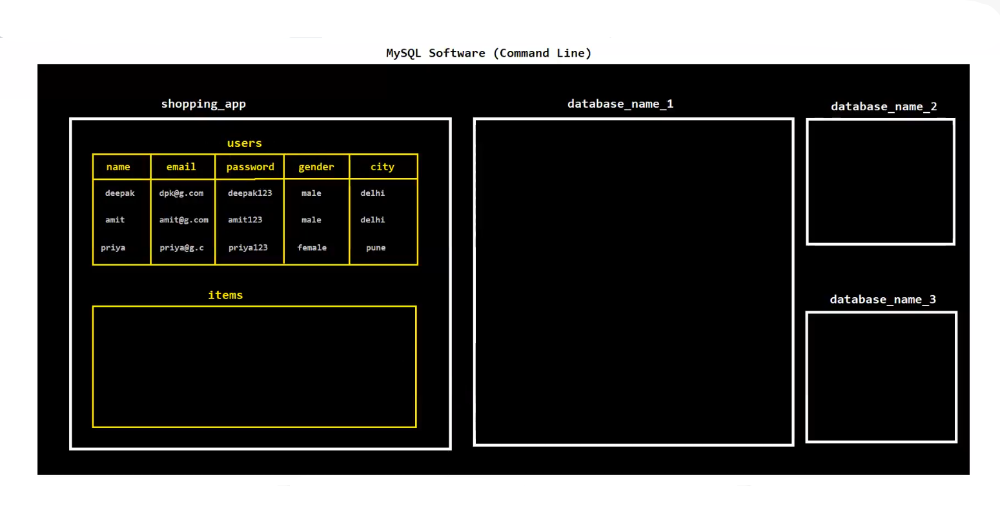

# 🗄️ SQL (Structured Query Language) — Complete Notes

---

## 📌 What is SQL?

SQL is a **query language** used to **access or manipulate databases** — we can `INSERT`, `UPDATE`, `DELETE`, `SELECT` and more to manage data efficiently.

---

## 🔤 Pre-defined Data Types

### 1. 🔡 String Data Types
| Type | Description |
|------|-------------|
| `VARCHAR(size)` | Variable-length string |
| `CHAR(size)` | Fixed-length string |
| `TEXT(size)` | Large text data |
| `MEDIUMTEXT(size)` | Medium-sized text |
| `BLOB` | Binary Large Object |
| `CLOB` | Character Large Object |

### 2. 🔢 Numeric Data Types
| Type | Description |
|------|-------------|
| `INT` | Integer numbers |
| `FLOAT` | Floating point numbers |
| `DECIMAL` | Fixed precision numbers |
| `DOUBLE` | Double precision numbers |

### 3. 📅 Date & Time Data Types
| Type | Description |
|------|-------------|
| `DATE` | Date value (YYYY-MM-DD) |
| `DATETIME` | Date + Time combined |
| `TIME` | Time value only |
| `TIMESTAMP` | Unix timestamp |

---

## ⚙️ Pre-defined Operators

### 1. ➕ Arithmetic Operators
`+`  `-`  `*`  `/`  `%`

### 2. 🔍 Comparison Operators
`=`  `!=`  `>`  `<`  `>=`  `<=`

### 3. 🧠 Logical Operators
`AND`  `OR`  `NOT`  `LIKE`  `BETWEEN`

---

## 📂 Types of SQL Commands

```
SQL Commands
├── 📐 DDL  — Data Definition Language
├── ✏️  DML  — Data Manipulation Language
├── 🔎 DQL  — Data Query Language
└── 💾 TCC  — Transaction Control Commands
```

| Type | Full Form | Commands |
|------|-----------|----------|
| 📐 **DDL** | Data Definition Language | `CREATE`, `ALTER`, `DROP`, `RENAME` |
| ✏️ **DML** | Data Manipulation Language | `INSERT`, `UPDATE`, `DELETE` |
| 🔎 **DQL** | Data Query Language | `SELECT` |
| 💾 **TCC** | Transaction Control Commands | `COMMIT`, `ROLLBACK`, `SAVEPOINT` |

---

## 📐 DDL — Data Definition Language

```sql
-- 📋 Show all databases
SHOW DATABASES;

-- 📋 Show all tables
SHOW TABLES;

-- 🆕 Create a new database
CREATE DATABASE database_name;

-- 🗑️ Drop a database
DROP DATABASE database_name;

-- 📂 Use a database
USE database_name;

-- 🏗️ Create a basic table
CREATE TABLE table_name (
    column_name DATA_TYPE(size),
    column_name DATA_TYPE(size)
);

-- 🏗️ Create a table with PRIMARY KEY & constraints
CREATE TABLE table_name (
    ID INT NOT NULL,
    column_name VARCHAR(100),
    column_name INT,
    PRIMARY KEY(ID)
);

-- 🔍 Describe table structure
DESC table_name;

-- ✏️ Rename a table
ALTER TABLE old_table_name RENAME TO new_table_name;

-- ➕ Add a new column
ALTER TABLE table_name ADD column_name DATA_TYPE(size);

-- ❌ Drop a column
ALTER TABLE table_name DROP COLUMN column_name;

-- 🗑️ Drop a table
DROP TABLE table_name;
```

---

## ✏️ DML — Data Manipulation Language

```sql
-- ➕ Insert data (all columns)
INSERT INTO table_name
VALUES ('value1', 'value2', 'value3');

-- ➕ Insert data (specific columns)
INSERT INTO table_name (column1, column2, column3)
VALUES ('value1', 'value2', 'value3');

-- 🔄 Update data
UPDATE table_name
SET column1 = 'value1', column2 = 'value2'
WHERE column_name = 'value3';

-- 🗑️ Delete data
DELETE FROM table_name
WHERE column_name = 'value';
```

---

## 🔎 DQL — Data Query Language

```sql
-- 📋 Select all columns
SELECT * FROM table_name;

-- 🔍 Select all with condition
SELECT *
FROM table_name
WHERE column_name = 'value';

-- 📌 Select specific columns
SELECT column1, column2
FROM table_name;

-- 🎯 Select specific columns with condition
SELECT column1, column2
FROM table_name
WHERE column_name = 'value';

-- 🔗 Select with multiple conditions
SELECT column1, column2
FROM table_name
WHERE column1 = 'value1' AND column2 = 'value2';
```

---

## 💾 TCC — Transaction Control Commands

```sql
-- ✅ Save all changes permanently
COMMIT;

-- ↩️ Undo changes since last commit
ROLLBACK;

-- 📍 Set a savepoint to rollback to
SAVEPOINT savepoint_name;

-- ↩️ Rollback to a specific savepoint
ROLLBACK TO savepoint_name;
```

---

## 🧠 Quick Reference Cheat Sheet

| Command | Type | Purpose |
|---------|------|---------|
| `CREATE` | DDL | 🏗️ Create database/table |
| `ALTER` | DDL | ✏️ Modify table structure |
| `DROP` | DDL | 🗑️ Delete database/table |
| `INSERT` | DML | ➕ Add new records |
| `UPDATE` | DML | 🔄 Modify existing records |
| `DELETE` | DML | ❌ Remove records |
| `SELECT` | DQL | 🔍 Query/retrieve data |
| `COMMIT` | TCC | ✅ Save transaction |
| `ROLLBACK` | TCC | ↩️ Undo transaction |
| `SAVEPOINT` | TCC | 📍 Mark a rollback point |

---

> 💡 **Tip:** Always use `WHERE` clause with `UPDATE` and `DELETE` to avoid modifying or deleting all records accidentally!

> ⚠️ **Remember:** DDL commands are **auto-committed** — they cannot be rolled back!


---



---