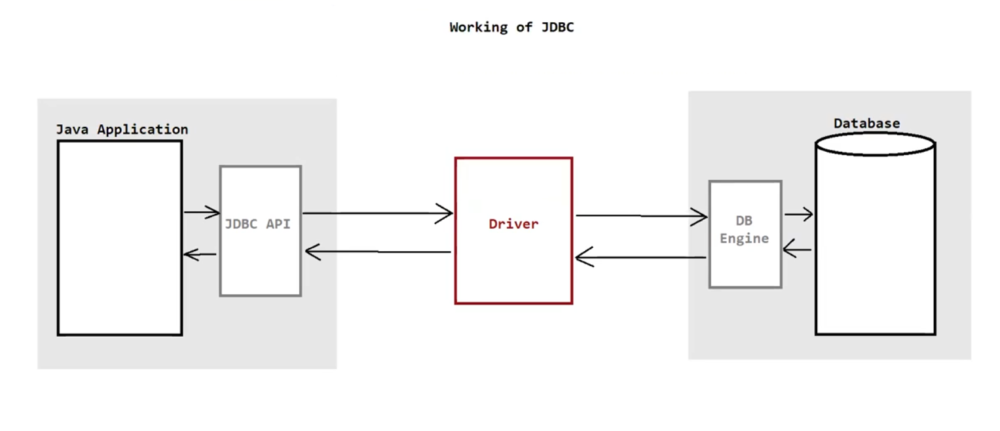
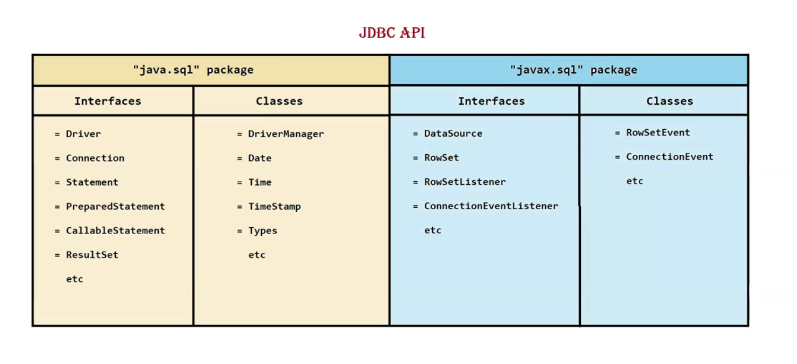
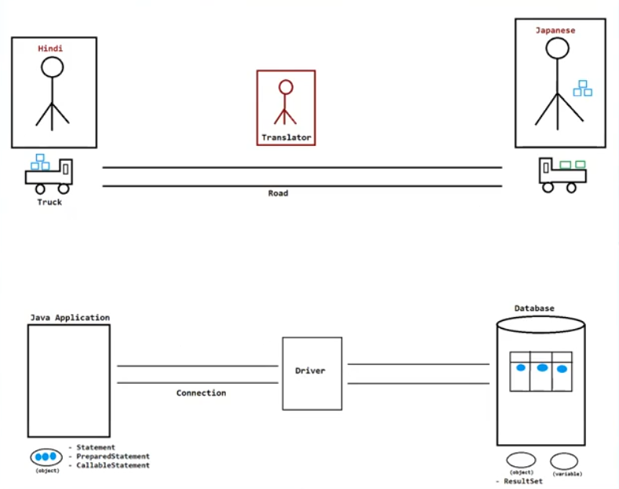

# ☕ JDBC — Java Database Connectivity

---

## 📌 What is JDBC?

- 🔤 **JDBC** stands for **Java Database Connectivity**
- 🔗 It is a **technology** used to interact a Java application with a database
- 📦 It is also an **API** (pre-defined interfaces, classes, and packages)

> 💡 **NOTE:** JDBC is an **abstraction** provided by **Sun Microsystems** and **implemented by database vendors** (who provide it in the form of **JAR files**)

---

## ⚙️ Working of JDBC

```
 ┌─────────────────────┐         ┌──────────────────┐         ┌──────────────┐
 │   Java Application  │ ──────► │   JDBC Driver    │ ──────► │   Database   │
 │                     │ ◄────── │   (Translator)   │ ◄────── │              │
 └─────────────────────┘         └──────────────────┘         └──────────────┘
        Java Calls           DB-Specific Calls / Results
```


---

## 🧩 JDBC Components

### 🚗 1. Driver *(Translator)*
- Converts **Java calls → Database-specific calls**
- Converts **Database-specific calls → Java calls**

### 🛣️ 2. Connection *(Road)*
- Creates a **connection** between the Java application and the database

### 🚛 3. Statement / PreparedStatement / CallableStatement *(Truck)*
- Sends **SQL Queries (with data)** from Java application → Database
- Retrieves the **result** back

### 📦 4. ResultSet *(Box)*
- Stores the **output/result** received from the database

---

---

## 🪜 Steps to Create a Database Connection

### ✅ Step 1 — Load and Register Driver
```java
Class.forName("Driver ClassName");
```

### ✅ Step 2 — Establish Connection
```java
DriverManager.getConnection("url", "username", "password");
```

### ✅ Step 3 — Create Statement Object
```java
Statement stmt = connection.createStatement();
// OR
PreparedStatement ps = connection.prepareStatement(sql);
// OR
CallableStatement cs = connection.prepareCall(sql);
```

### ✅ Step 4 — Send and Execute SQL Query
```java
ResultSet rs = stmt.executeQuery("SELECT * FROM table_name");
// OR
int rows = stmt.executeUpdate("INSERT INTO ...");
```

### ✅ Step 5 — Process the Result
```java
while (rs.next()) {
    System.out.println(rs.getString("column_name"));
}
```

### ✅ Step 6 — Close All Resources 🔒
```java
rs.close();
stmt.close();
connection.close();
```

---

## 🗂️ Quick Summary Table

| 🔢 Step | 🎯 Action | 🛠️ Method/Class Used |
|--------|----------|----------------------|
| 1️⃣ | Load Driver | `Class.forName()` |
| 2️⃣ | Establish Connection | `DriverManager.getConnection()` |
| 3️⃣ | Create Statement | `Statement` / `PreparedStatement` / `CallableStatement` |
| 4️⃣ | Execute SQL Query | `executeQuery()` / `executeUpdate()` |
| 5️⃣ | Process Result | `ResultSet` |
| 6️⃣ | Close Resources | `.close()` |

---

---
> 📝 *Notes by — Java Backend Series*