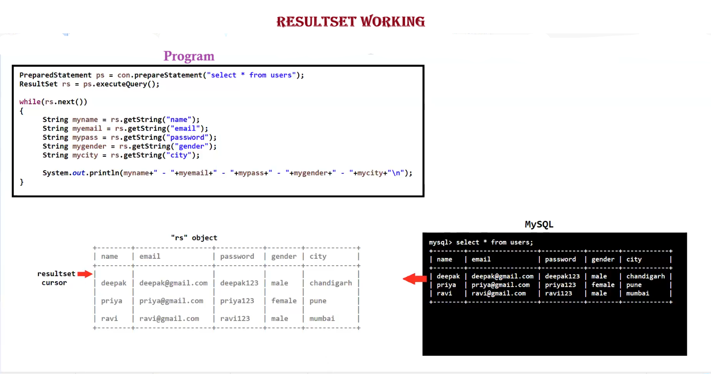

# 📋 ResultSet — Java JDBC Notes

---

## 🔷 What is ResultSet?

> **ResultSet** is an **interface** in Java JDBC that:
> - 📦 Contains the data returned by a SQL query
> - 🖱️ Manages a **cursor** to access/navigate through the data row by row

---

## ⚙️ Methods of ResultSet

### 1️⃣ Navigation Methods

| Method | Description |
|---|---|
| `next()` | ➡️ Moves cursor to the next row |
| `previous()` | ⬅️ Moves cursor to the previous row |
| `first()` | ⏮️ Moves cursor to the first row |
| `last()` | ⏭️ Moves cursor to the last row |
| `beforeFirst()` | ⏪ Moves cursor before the first row |
| `afterLast()` | ⏩ Moves cursor after the last row |
| `absolute(n)` | 🎯 Moves cursor to the nth row (absolute position) |
| `relative(n)` | 🔀 Moves cursor relative to current position |

---

### 2️⃣ Getter Methods

| Method | Description |
|---|---|
| `getString(column)` | 📝 Gets value as `String` |
| `getInt(column)` | 🔢 Gets value as `int` |
| `getXXX(column)` | 🔣 Gets value as the specified type (e.g., `getDouble`, `getBoolean`, etc.) |

> 💡 **Tip:** The `column` parameter can be either the **column index** (starts at 1) or the **column name** as a String.

---

## 🖱️ Types of ResultSet Cursor

### 1️⃣ Forward-Only ResultSet 🔁

- ✅ Allows traversal of data **only in the forward direction**
- 💾 Most **memory-efficient** type
- ❌ Cannot go backward

```java
// 📌 Constant
ResultSet.TYPE_FORWARD_ONLY
```

---

### 2️⃣ Scrollable ResultSet 🔄

- ✅ Allows traversal in **both forward and backward** directions
- Two subtypes:

| Type | Constant | Description |
|---|---|---|
| 🔇 Scroll Insensitive | `ResultSet.TYPE_SCROLL_INSENSITIVE` | Does **not** reflect changes made to the DB after ResultSet is opened |
| 🔔 Scroll Sensitive | `ResultSet.TYPE_SCROLL_SENSITIVE` | **Reflects** changes made to the DB while ResultSet is open |

---

### 🛠️ How to Use?

```java
// ✅ Syntax — Using PreparedStatement with ResultSet type

PreparedStatement ps = con.prepareStatement(
    "SELECT * FROM table_name",
    ResultSet.TYPE_FORWARD_ONLY      // 👈 Change this to your desired type
);

ResultSet rs = ps.executeQuery();

while (rs.next()) {  // ➡️ Navigate forward
    System.out.println(rs.getString("column_name"));
}
```

> 🔔 **Note:** For `TYPE_SCROLL_INSENSITIVE` or `TYPE_SCROLL_SENSITIVE`, you also need to specify a **concurrency type**:
> - `ResultSet.CONCUR_READ_ONLY` — 👁️ Read only
> - `ResultSet.CONCUR_UPDATABLE` — ✏️ Can update the ResultSet

```java
// ✅ Full Example — Scrollable ResultSet

PreparedStatement ps = con.prepareStatement(
    "SELECT * FROM employees",
    ResultSet.TYPE_SCROLL_INSENSITIVE,
    ResultSet.CONCUR_READ_ONLY
);

ResultSet rs = ps.executeQuery();

rs.last();                          // ⏭️ Jump to last row
System.out.println(rs.getRow());    // 🔢 Prints total number of rows

rs.first();                         // ⏮️ Go back to first row
System.out.println(rs.getString("name"));
```

---

## 📊 Quick Comparison Table

| Feature | Forward-Only 🔁 | Scroll Insensitive 🔇 | Scroll Sensitive 🔔 |
|---|---|---|---|
| Forward Navigation | ✅ | ✅ | ✅ |
| Backward Navigation | ❌ | ✅ | ✅ |
| Reflects DB Changes | ❌ | ❌ | ✅ |
| Memory Efficient | ✅✅ | ⚠️ | ⚠️ |

---



---

*📚 Notes prepared for JDBC — ResultSet Interface*