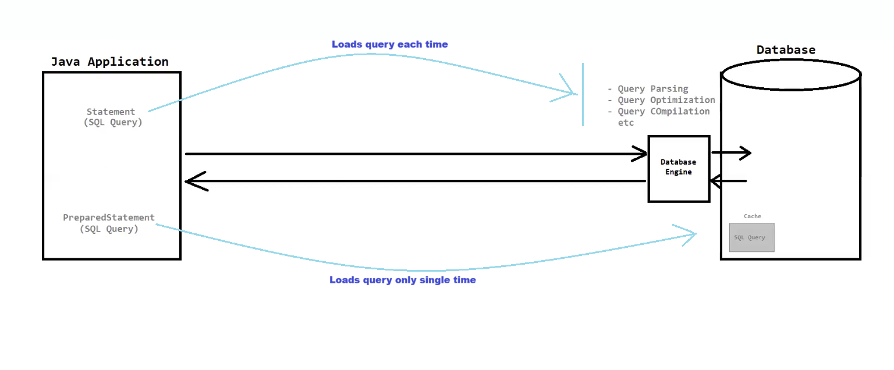

# 📝 JDBC Notes — Statement vs PreparedStatement

---

## 📌 Statement

> Statement objects are used to execute **simple SQL queries** without any parameters.

- 🔹 Best suited for **static queries** that do **not** involve any user inputs.
- 🐢 **Performance is low** as compared to `PreparedStatement`.
- 🔓 **Less secured** — vulnerable to SQL Injection attacks.

---

## 📌 PreparedStatement

> PreparedStatement objects are used to execute **parameterized SQL queries**.

- 🔹 Best suited for **dynamic queries** which involve user inputs.
- ⚡ **Performance is fast** as compared to `Statement`.
- 🔐 **More secured** — protects against SQL Injection attacks.

---

## ✅ Why Use PreparedStatement Over Statement?

| # | Reason |
|---|--------|
| 1️⃣ | ⚡ **Fast performance** — query is pre-compiled by the database |
| 2️⃣ | 🔐 **More secure** — prevents SQL Injection |
| 3️⃣ | 📖 **Improves code readability & maintainability** |
| 4️⃣ | ♻️ **Reusable** — same query can be executed multiple times with different parameters |

---

## 🛡️ SQL Injection Attack

> 💣 SQL Injection is a type of **cybersecurity attack** that targets the database. It is used to manipulate or gain **unauthorized access** to the data stored within the database.

### 🔍 Key Points:

- 🔑 The **root cause** of SQL Injection is the **mixing of "SQL query" and "data"**.
- ⚠️ It occurs **only** in the `Statement` interface.
- 🚫 `PreparedStatement` is **NOT** vulnerable to SQL Injection.

### 🤔 How Does PreparedStatement Protect Against SQL Injection?

> ✅ Because the **"SQL Query"** and **"data"** are sent **separately** to the database server.
>
> This means user input is **never interpreted as SQL code** — it is always treated as plain data. 🎯

---

## 🔄 Quick Comparison Table

| Feature | 📄 Statement | 🛡️ PreparedStatement |
|---------|-------------|----------------------|
| Query Type | Static (no params) | Dynamic (with params) |
| Performance | 🐢 Slow | ⚡ Fast |
| Security | 🔓 Less Secure | 🔐 More Secure |
| SQL Injection | ⚠️ Vulnerable | ✅ Protected |
| Code Readability | 😐 Moderate | 😊 Better |
| Use Case | Simple queries | User-input queries |

---

---

> 💡 **Best Practice:** Always prefer `PreparedStatement` over `Statement` when dealing with user inputs or dynamic queries!