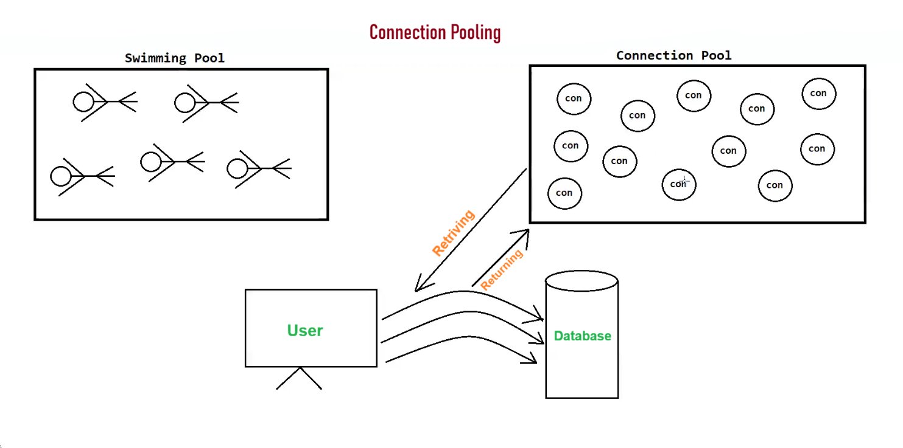

# 📘 JDBC — Connection & Connection Pooling Notes

---

## 🔌 Ways to Get a Connection Object

There are **2 ways** to obtain a connection object:

| # | Method | Package |
|---|--------|---------|
| 1️⃣ | `DriverManager` (class) | `java.sql` |
| 2️⃣ | `DataSource` (interface) | `javax.sql` |

---

## 🧱 DriverManager

- A **class** present in the `java.sql` package.

**How to get a connection:**
```java
Connection con = DriverManager.getConnection("URL", "USERNAME", "PASSWORD");
```

### ❌ Drawbacks of DriverManager

1. 🐢 Takes a **lot of time** to open a database connection over a network → slows down app performance.
2. 📉 Performance **decreases** as the number of clients increases.
3. ♻️ Connection objects are **not reusable** → every new request creates a fresh connection.

---

## 🗄️ DataSource

- An **interface** present in the `javax.sql` package.
- Defines a **standardized way** to obtain database connections.

### 🔧 Common Implementations

| Implementation | Database |
|----------------|----------|
| `MysqlDataSource` | MySQL |
| `OracleDataSource` | Oracle |
| `JdbcDataSource` | H2 (in-memory, lightweight, open-source) |

> ⚠️ **Note:** The above implementations do **not** have built-in connection pooling.

### ✅ Why Use DataSource over DriverManager?

1. 🛠️ Easy configuration
2. 🔄 Easy to switch across different databases
3. 🤖 Automatic driver loading
4. 🧹 Cleaner and more readable code

> 🌟 **Most Important Advantage → Connection Pooling!**

---

## 🏊 Connection Pool

- A **group of reusable connection objects** for a particular database.
- App **requests** a connection → gets one from the pool.
- App **closes** a connection → it returns back to the pool.

---



---
## ⚡ Connection Pooling

A technique to **manage and reuse** existing database connection objects instead of creating new ones from scratch every time.

> 🍽️ **Real World Analogy:** Like cooking in a restaurant — reuse pots and pans rather than buying new ones for every dish!

### 🎯 Benefits
- ✅ Improves **application performance**
- ✅ Better **resource utilization**
- ✅ Minimizes time and cost of establishing connections

---

## 🛠️ Ways to Provide Connection Pooling

### 1️⃣ Third-Party Connection Pooling Libraries

| Library | DataSource Class | Highlights |
|---------|-----------------|------------|
| 🚀 **HikariCP** | `HikariDataSource` | High performance, lightweight, ideal for modern apps |
| 🐘 **Apache Commons DBCP** | `BasicDataSource` | Widely used, configurable connection management |
| 🌀 **C3P0** | `ComboPooledDataSource` | Connection testing & customization options |
| 🦴 **BoneCP** | `BoneCPDataSource` | Lightweight, designed for speed & efficiency |

### 2️⃣ Application Server-Provided Pooling 🖥️
- Servers like **Apache Tomcat**, **WildFly**, etc. come with **built-in** connection pooling.

### 3️⃣ Spring Framework 🍃
- Provides its **own connection pooling** support via `DataSource` abstraction.
- Also supports **integration** with third-party pooling libraries.
- **SPRING does NOT provide built-in connection pooling**

---

## 📝 Key Takeaways

> ⚠️ **JDBC does NOT provide built-in connection pooling** — but third-party libraries can be integrated with JDBC to achieve it.

| Feature | DriverManager | DataSource |
|---------|--------------|------------|
| Connection Reuse | ❌ | ✅ |
| Connection Pooling | ❌ | ✅ (via third-party) |
| Performance | 🐢 Slow | 🚀 Fast |
| Code Readability | 😐 Okay | 😊 Clean |
| Auto Driver Loading | ❌ | ✅ |

---

# ===> 2 jar file used in HikariCP <===

1. HikariCP-7.0.2
2. slf4j-api-2.0.17

---