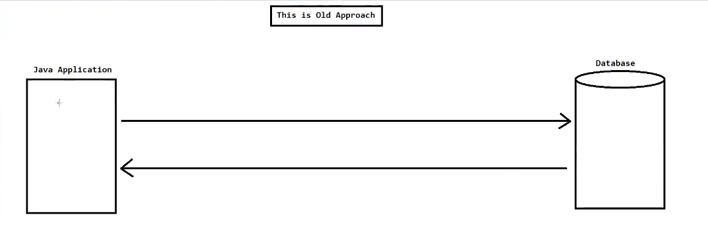
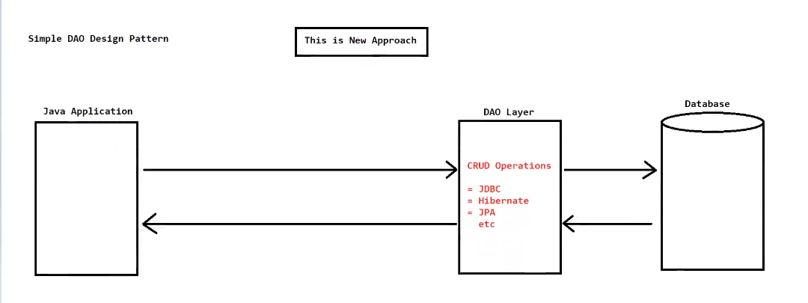
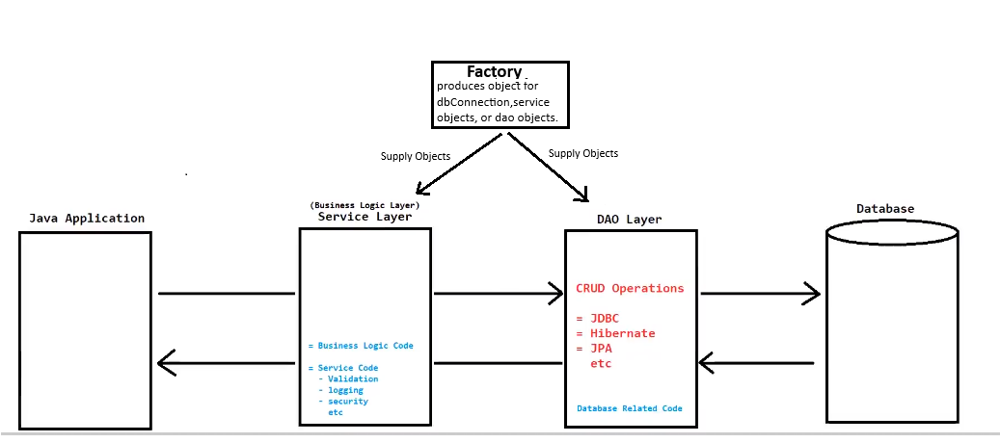
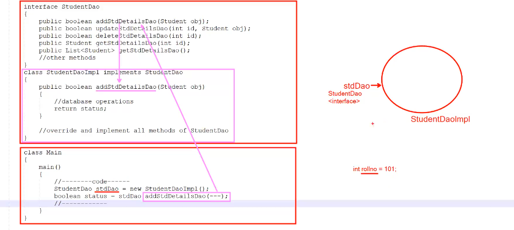

# 🎨 Design Patterns

## 📌 What are Design Patterns?

> 🔖 **Design patterns** are established best practices and reusable templates for solving common software design problems.

- ✅ **"Established best practices"** means these practices have been **tried, tested, and widely recognized** as effective solutions.
- 🏗️ They offer **structured approaches** to create relationships and interactions between classes and objects.
- 🚀 They promote **efficient, maintainable, and scalable** code.

---

## 📚 Examples of Design Patterns

| # | Pattern Name |
|---|-------------|
| 1️⃣ | Singleton Design Pattern |
| 2️⃣ | Factory Design Pattern |
| 3️⃣ | Abstract Factory Design Pattern |
| 4️⃣ | Prototype Design Pattern |
| 5️⃣ | DAO Design Pattern |
| 6️⃣ | MVC Design Pattern |
| 7️⃣ | Dependency Injection Design Pattern |
| ➕ | ...and many more! |

---

## 📖 Famous Book on Design Patterns

> 📕 **"Design Patterns: Elements of Reusable Object-Oriented Software"**
>
> *(A must-read for every software developer!)*

---
---

# 🗄️ DAO Design Pattern

## 📌 What is DAO?

> 💡 **DAO** stands for **"Data Access Object"**

---

## 🎯 Purpose

- 🔀 It is used to **separate the data persistence logic** into a **separate layer**.
- 🛡️ This way, any other layer (e.g., Service Layer) does **NOT** know how low-level operations are performed to access the database.
- 🧩 Promotes **loose coupling** between business logic and data access logic.

---

---



---

---



---

---



---

## 🏛️ Architecture Diagram

```
┌─────────────────────────────────────────────┐
│              📱 Presentation Layer          │
│                  (UI / View)                │
└──────────────────────┬──────────────────────┘
                       │
                       ▼
┌─────────────────────────────────────────────┐
│              ⚙️ Service Layer               │
│             (Business Logic)                │
└──────────────────────┬──────────────────────┘
                       │
                       ▼
┌─────────────────────────────────────────────┐
│             🗄️ DAO Layer                    │
│    ┌────────────────────────────────────┐   │
│    │     «interface» StudentDao         │   │
│    │  + addStdDetailsDao()              │   │
│    │  + updateStdDetailsDao()           │   │
│    │  + deleteStdDetailsDao()           │   │
│    │  + getStdDetailsDao()              │   │
│    └──────────────────┬─────────────────┘   │
│                       │ implements          │
│    ┌──────────────────▼─────────────────┐   │
│    │       StudentDaoImpl               │   │
│    │  (JDBC / Hibernate / JPA logic)    │   │
│    └────────────────────────────────────┘   │
└──────────────────────┬──────────────────────┘
                       │
                       ▼
┌─────────────────────────────────────────────┐
│              🗃️ Database                    │
│           (MySQL / Oracle / etc.)           │
└─────────────────────────────────────────────┘
```

---

## 🛠️ How to Achieve DAO Layer?

Follow these **3 steps** 👇

### 🔹 Step 1 — Create a DAO Package
```
📦 com.example.dao
```

### 🔹 Step 2 — Create an Interface
Define **abstract methods** that represent database operations.

### 🔹 Step 3 — Create Implementation Class
**Override / implement** all the methods from the interface.

---

## 💻 DAO Program — Using Plain JDBC

### 🔷 Interface

```java
interface StudentDao {
    public boolean addStdDetailsDao(Student obj);
    public boolean updateStdDetailsDao(int id, Student obj);
    public boolean deleteStdDetailsDao(int id);
    public Student getStdDetailsDao(int id);
    public List<Student> getStdDetailsDao();
    // other methods...
}
```

### 🔷 Implementation Class

```java
class StudentDaoImpl implements StudentDao {

    public boolean addStdDetailsDao(Student obj) {
        // 🗄️ database operations using JDBC
        return status;
    }

    // 🔄 override and implement all methods of StudentDao
}
```

### 🔷 Main Class

```java
class Main {
    main() {
        // ---------code---------
        StudentDao stdDao = new StudentDaoImpl();    // ✅ Polymorphism
        boolean status = stdDao.addStdDetailsDao(---);
        // ----------------------
    }
}
```

---

---



---

## ✅ Benefits of DAO Pattern

| 🏷️ Benefit | 📝 Description |
|------------|----------------|
| 🔒 **Abstraction** | Hides database implementation details |
| 🔄 **Flexibility** | Easily switch databases without changing business logic |
| 🧹 **Clean Code** | Separates concerns across different layers |
| 🧪 **Testability** | Easy to mock DAO for unit testing |
| ♻️ **Reusability** | DAO methods can be reused across the application |

---

> 💬 *"Good architecture is not about making it correct, it's about making it easy to change."*


