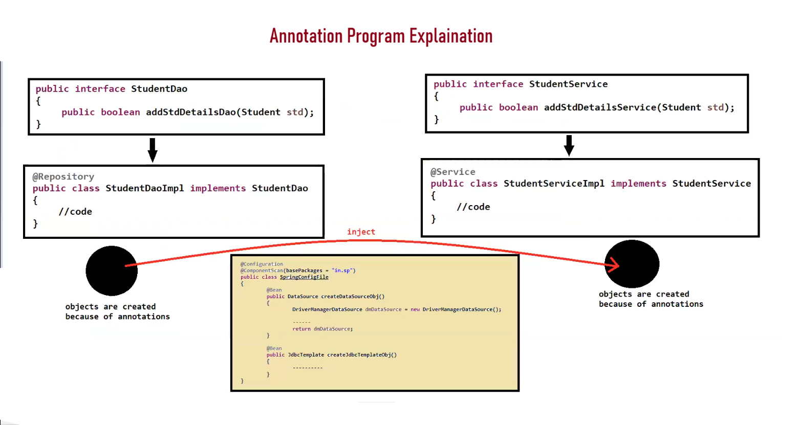
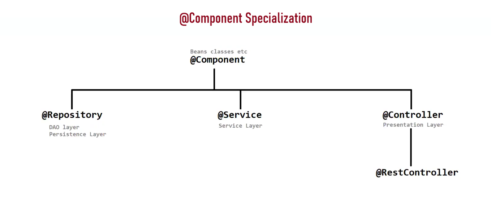

# 🌱 Spring DAO Notes

---

## 🗄️ What is Spring DAO?

> **Spring DAO** is a **concept (design pattern)** used to work with database technologies like **JDBC**, **Hibernate**, **JPA**, etc. in an easy and consistent way.

---

## 🛤️ Ways to Achieve DAO Design Pattern in Spring

We can implement the DAO design pattern in Spring using **3 approaches**:

| # | Approach |
|---|----------|
| 1️⃣ | Straight-forward and Traditional Way |
| 2️⃣ | By Extending DAO Support Classes |
| 3️⃣ | By Using Annotations |

---

## 1️⃣ Straight-forward & Traditional Way

- ✍️ Involves creation of **custom classes** to perform data access operations.
- 🔧 Done in a **traditional way** — without relying on Spring's pre-defined classes or annotations.
- 📦 Full manual control over the DAO implementation.

---

## 2️⃣ By Extending DAO Support Classes

- 🏗️ Spring provides built-in **DAO Support Classes** (`XxxDaoSupport`) to simplify DAO development.
- 🔑 **2 Main DAO Support Classes:**

### 📌 `JdbcDaoSupport`

```java
public final void setDataSource(DataSource dataSource) { ... }
public final void setJdbcTemplate(JdbcTemplate jdbcTemplate) { ... }
public final JdbcTemplate getJdbcTemplate() { ... }
```

### 📌 `NamedParameterJdbcDaoSupport`

```java
public NamedParameterJdbcTemplate getNamedParameterJdbcTemplate() { ... }
```

> ⚠️ **NOTE:** This is **not a standalone approach** — you still need to extend and customize these classes to create your specific DAOs.

---

## 3️⃣ By Using Annotations ✨

- 🎯 Spring provides annotations to **simplify configuration** and make DAOs more **concise** and **declarative**.

### 🏷️ Main Annotations:

| Annotation | Layer | Description |
|---|---|---|
| `@Repository` | 🗄️ DAO Layer | Specialization of `@Component` — marks a class as a DAO |
| `@Transactional` | 🔄 Transaction | Used for **transaction management** |
| `@Service` | ⚙️ Service Layer | Specialization of `@Component` — marks a class as a Service |
| `@Autowired` | 🔗 Dependency | Injects dependencies automatically |

---

## 🔍 Annotation Details

### 🗄️ `@Repository`
- Used with the **DAO layer**.
- It is a **specialization of `@Component`**.
- Enables Spring to detect DAOs via **component scanning**.
- Also translates **persistence exceptions** into Spring's DataAccessException hierarchy.

```java
@Repository
public class UserDaoImpl implements UserDao {
    // data access logic here
}
```

---

### 🔄 `@Transactional`
- Used for **transaction management**.
- Can be applied at **class level** or **method level**.
- Handles commit/rollback automatically.

```java
@Transactional
public void saveUser(User user) {
    // transaction handled automatically
}
```

---

### ⚙️ `@Service`
- Used with the **service layer**.
- It is a **specialization of `@Component`**.
- Marks the class as containing **business logic**.

```java
@Service
public class UserServiceImpl implements UserService {
    // business logic here
}
```

---

### 🔗 `@Autowired`
- Used for **dependency injection**.
- Spring automatically injects the required bean.

```java
@Autowired
private UserDao userDao;
```

---

## 🧠 Quick Summary

```
Spring DAO
├── 1️⃣  Traditional Way        → Custom classes, full manual control
├── 2️⃣  DAO Support Classes    → Extend JdbcDaoSupport / NamedParameterJdbcDaoSupport
└── 3️⃣  Annotations            → @Repository, @Transactional, @Service, @Autowired
```

---

> 💡 **Best Practice:** Use the **Annotation-based approach** for modern Spring applications — it's the most concise, readable, and maintainable! 🚀

---

### Annotations Program Explanation



---
### @Component Specialization


---