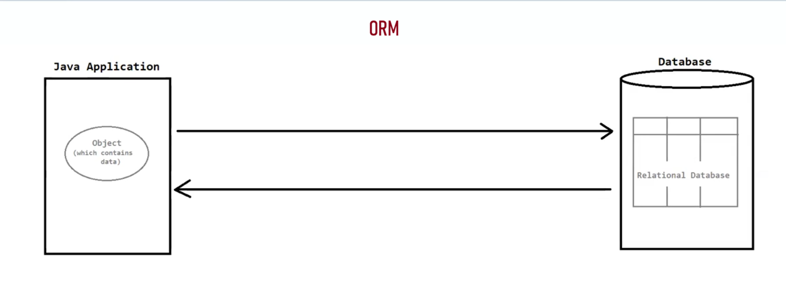
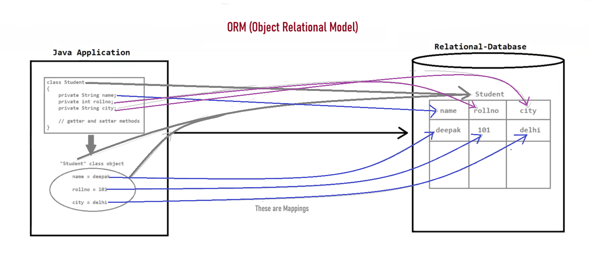

# 📚 Java Persistence & ORM — Study Notes

---

## 🗺️ ORM (Object-Relational Mapping)

### 🔍 What is ORM?
ORM is a **programming technique** that allows data to be mapped between:
- **Objects** 🧱 → in Object-Oriented Programming code
- **Relational Databases** 🗄️ → using XML files or annotations

> 💡 Think of it like OOP, AOP — it's a **paradigm/technique**, not a product!

---

### 🔄 How ORM Maps Things

| 🧱 Object Side        | 🗄️ Database Side       |
|----------------------|------------------------|
| Model Class (Object) | Table                  |
| Properties           | Table Columns          |
| Property Values      | Rows in the Table      |

---

### ✅ Why Use ORM?
ORM **simplifies database interactions** in object-oriented languages, making it much easier for developers to work with databases — no raw SQL required! 🙌

---

### 🛠️ Popular Java ORM Tools / Frameworks

1. 🌟 **Hibernate** — Most popular ORM framework for Java
2. ☕ **JPA** (Java Persistence API) — Standard Java specification
3. 🔗 **TopLink** — Oracle's ORM solution
4. ⚡ **EclipseLink** — Reference implementation of JPA
5. 🗺️ **MyBatis** — SQL mapper framework (lighter ORM)
6. … and more!

---

### 📝 Important Notes

> ⚠️ **ORM is NOT owned by anyone!**
> ORM is **not developed by a specific individual or organization** — it is a **collaborative programming technique** that many organizations contribute to together.

> 🗄️ **ORM works with Relational Databases only (typically)**
> - ✅ Works great with: **MySQL, Oracle, SQL Server, PostgreSQL**, etc.
> - ❌ Not normally used with: **NoSQL databases** like MongoDB, Cassandra, Redis, etc.

---

## 💾 Data Persistency

### 📖 What Does It Mean?
- **Data** = Information 📄
- **Persistency** = Permanent 🔒

➡️ **Data Persistency** is the ability to **store data permanently** so that it is **NOT lost** when the program or system stops running.

---

### 🧰 Techniques to Achieve Data Persistency in Java

```
Data Persistency in Java
│
├── 1️⃣  Serialization & Deserialization
│       📦 Convert objects to byte streams & back
│
├── 2️⃣  JDBC (Java Database Connectivity)
│       🔌 Low-level direct database connection
│
└── 3️⃣  ORM (Object-Relational Mapping)
        🗺️ High-level abstraction over databases
        │
        ├── 🌟 Hibernate
        ├── ☕ JPA
        ├── 🔗 TopLink
        ├── ⚡ EclipseLink
        ├── 🗺️ MyBatis
        └── ... etc
```

---

> 🧠 **Quick Recap:**
> ORM is a **technique** (not a tool) that bridges the gap between OOP and relational databases.
> Data Persistency is the **goal** — and ORM is one of the best ways to achieve it in Java! 🚀

---





---