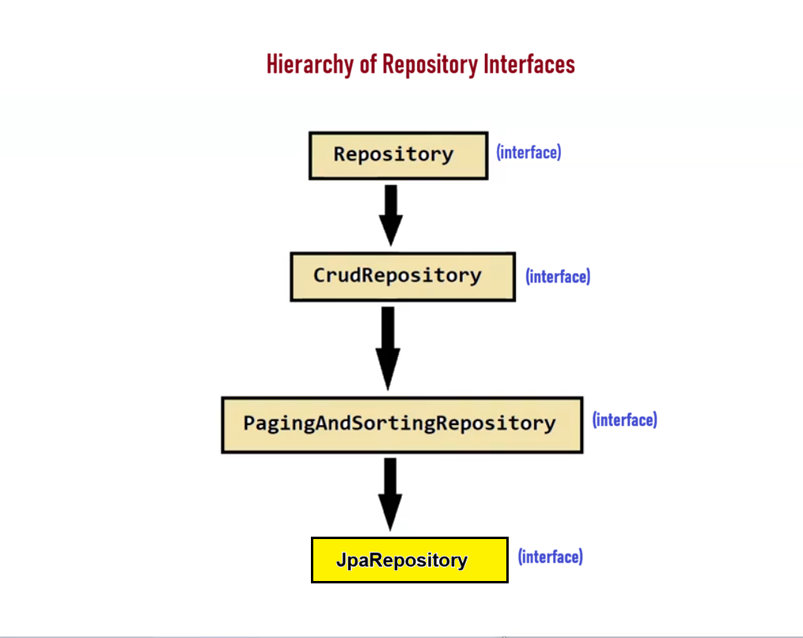

# 🌱 Spring Data Access

## 📌 What is it?
Spring Data Access is the part of the **Spring Framework** that aims to **simplify data access** in Spring applications by offering **abstractions and tools** for relational databases, NoSQL databases, etc.

## 🧩 Modules in Spring Data Access

| # | Module | Focus |
|---|--------|-------|
| 1️⃣ | **Spring Data JPA** 🗄️ | Relational database access using JPA |
| 2️⃣ | **Spring Data MongoDB** 🍃 | NoSQL access using MongoDB |
| 3️⃣ | **Spring Data Cassandra** 🌐 | Working with Apache Cassandra (NoSQL) |
| 4️⃣ | **Spring Data Redis** ⚡ | Caching & key-value data storage in Redis |
| 5️⃣ | **Spring Data Neo4j** 🔗 | Graph database access using Neo4j |
| ➕ | *...and more* | |

---

# 🗄️ Spring Data JPA

## 📌 What is it?
Spring Data JPA is part of the larger **Spring Data Project** which provides a **simplified and consistent** way to work with **JPA** in Spring-based applications.

## 🛠️ Repository Interfaces
Spring Data JPA provides **"Repository Interfaces"** — a convenient way to perform common database operations **without writing actual database queries or boilerplate code**.

### 📚 Some Repository Interfaces in Spring Data JPA:
1. 🧱 `Repository`
2. ➕ `CrudRepository`
3. 📄 `PagingAndSortingRepository`
4. 🚀 `JpaRepository`
5. ➕ *...etc*

## 🌳 Hierarchy of Repository Interfaces

```
Repository
   ⬆️
CrudRepository
   ⬆️
PagingAndSortingRepository
   ⬆️
JpaRepository
```
> 🖼️ Diagram



## ⚙️ Types of Methods Provided

All Spring Data JPA Repository Interfaces provide **2 types of methods**:

| Type | Description |
|------|--------------|
| 1️⃣ 🔄 **Core CRUD Operation Methods** | Used for basic data manipulation (Create, Read, Update, Delete) |
| 2️⃣ 🔍 **Query Methods** | Used to define custom queries using method naming conventions or custom JPQL/SQL queries |

---
✅ *End of Notes*