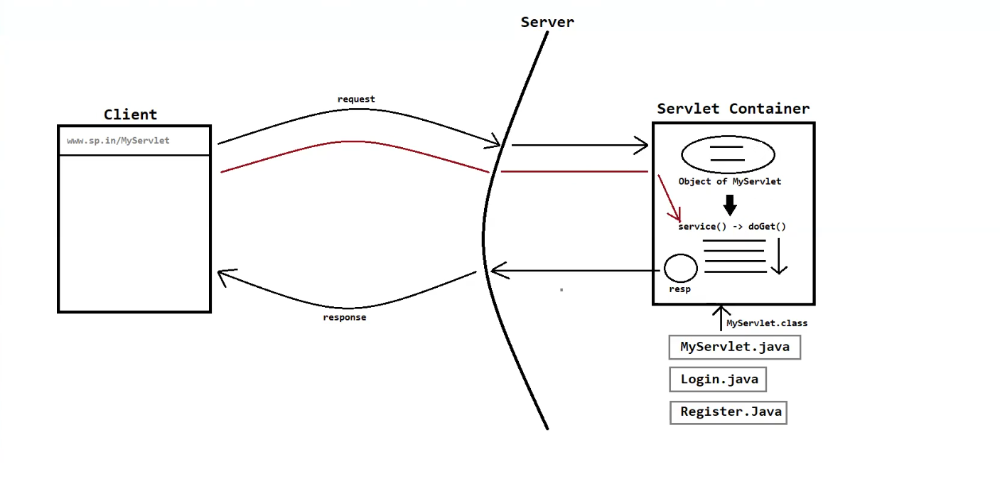

# 📚 Servlet Notes

---

## 🏗️ Hierarchy of `HttpServlet`


```
                java.lang.Object
                       │
                       ▼
        ┌──────────────────────────┐
        │   interface Servlet      │
        └──────────────────────────┘
                       ▲
                       │ implements
                       │
        ┌──────────────────────────┐
        │ abstract class           │
        │ GenericServlet           │
        └──────────────────────────┘
                       ▲
                       │ extends
                       │
        ┌──────────────────────────┐
        │ abstract class           │
        │ HttpServlet              │
        └──────────────────────────┘
                       ▲
                       │ extends
                       │
        ┌──────────────────────────┐
        │ MyServlet (user-defined) │
        └──────────────────────────┘
```

> 📝 **NOTE:** We commonly use the `HttpServlet` abstract class because it provides HTTP methods (`doGet()`, `doPost()`, `doPut()`, `doDelete()`, etc.) 🌐

---

## 🔄 Servlet Life-Cycle

The Servlet Life-Cycle consists of the following steps:

### 1️⃣ Loading & Instantiation 📥
- When the servlet is first requested, or when the web application starts, the servlet class is **loaded** into the servlet container.
- A **new instance** of that servlet class is created. 🆕

### 2️⃣ Initialization ⚙️
- After instantiation, the **`init()`** method is called by the servlet container to initialize the servlet object.
- We can **override** `init()` to perform one-time setup operations, e.g.:
  - 📂 Loading configuration data
  - 🗄️ Establishing database connections
  - 🔧 Initializing resources

### 3️⃣ Request Handling 📨
- Once initialized, the servlet is ready to handle client requests.
- The **`service()`** method is called by the container for each incoming HTTP request.
- `service()` examines the request, determines the appropriate HTTP method (`GET`, `POST`, etc.), and delegates it to the corresponding **`doXXX()`** method (`doGet()`, `doPost()`, etc.). 🔀

### 4️⃣ Response Generation 📤
- During request handling, the servlet generates a response — this may include **HTML**, **XML**, **JSON**, etc. 🧾
- The response is written to the **`HttpServletResponse`** object associated with the request.

### 5️⃣ Termination / Destruction 🧹
- When the servlet container decides to shut down the web application or unload the servlet, it calls the **`destroy()`** method.
- `destroy()` allows us to perform cleanup operations, e.g.:
  - 🔌 Closing database connections
  - 🗑️ Releasing resources

### 6️⃣ Servlet Deinstantiation ❌
- After `destroy()` is called, the servlet container **removes the servlet instance** from memory.

---

## ⚠️ Important Notes

- 🧭 The Servlet Life-Cycle is **managed by the Servlet Container**.
- 🔂 **Loading, Instantiation, and Initialization** are executed **only once**.
- 🧵 When a client sends **multiple requests**, a **new thread** is created for each request, and every thread executes the **`service()`** method **separately**.

---
## 💫 Example 



---