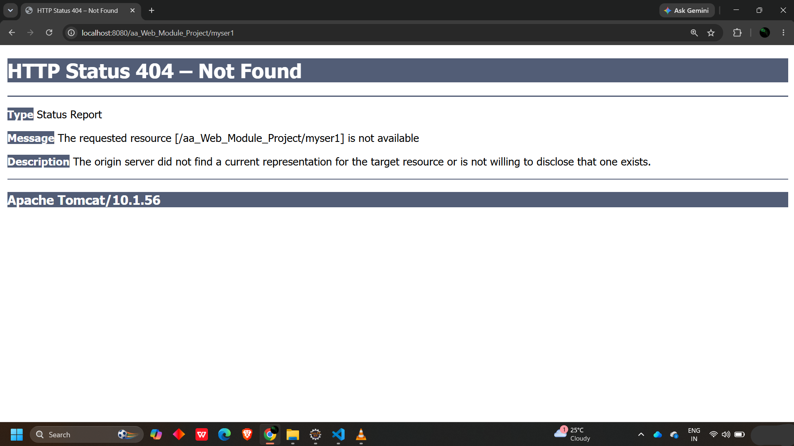

# 📝 Annotations in Java & Servlets

## 🔷 Annotations in Java

- 🏷️ Annotations are **metadata (information)** added to programming elements — i.e. class, interface, method, constructor, variable, etc.
- ⚙️ Annotations are used for **configuration, documentation**, and to convey **additional information** at compile-time or runtime.
- 🔤 Annotations always start with **`@`**.

### 📂 Categories of Annotations

#### 1️⃣ Marker Annotations
- 🚩 Used to **mark** a declaration.
- ❌ Does **not** contain any members or data.
- 📌 Examples: `@Override`, `@Deprecated`, `@FunctionalInterface`

#### 2️⃣ Single Value Annotations
- 1️⃣ Contains **only one member**.
- 📌 Example: `@SuppressWarnings("unchecked")`

#### 3️⃣ Full Annotations
- 📦 Consists of **multiple data members** (name–value pairs).
- 📌 Example:
  ```java
  @Bean(name="----", initMethod="-----", destroyMethod="----")
  ```

---

## 🔷 Annotations in Servlet

- 🌐 In Java Servlets, annotations are used to **simplify the configuration** of servlets and other components in a web application — i.e. Filters, Listeners, etc.
- ✍️ Annotations let us declare settings and behavior **directly in the source code**, rather than configuring them in `web.xml`.
- 🎯 This makes the code **more concise and easier to maintain**.

### 🛠️ Commonly Used Servlet Annotations

| # | Annotation | Purpose |
|---|------------|---------|
| 1️⃣ | `@WebServlet` | Defines a servlet |
| 2️⃣ | `@WebFilter` | Defines a filter |
| 3️⃣ | `@WebListener` | Defines a listener |
| 4️⃣ | `@WebInitParam` | Defines init parameters |
| 5️⃣ | `@MultipartConfig` | Configures multipart/file upload support |

---

## 🔷 `@WebServlet` 🎯

- 🧩 Used to **define a servlet**.
- 🔧 We can specify the servlet's **name**, **URL pattern**, and other configuration settings within this annotation itself.

### 💻 Syntax

```java
@WebServlet(name="----", urlPatterns={"----"})
public class MyServlet extends HttpServlet
{
    // 🔨 override the methods
}
```
---

### Error

- Browser not get/find the correct address of servlet page.


---

✅ **Key Takeaway:** Annotations reduce boilerplate XML configuration (`web.xml`) and keep servlet setup clean, readable, and close to the code it configures! 🚀