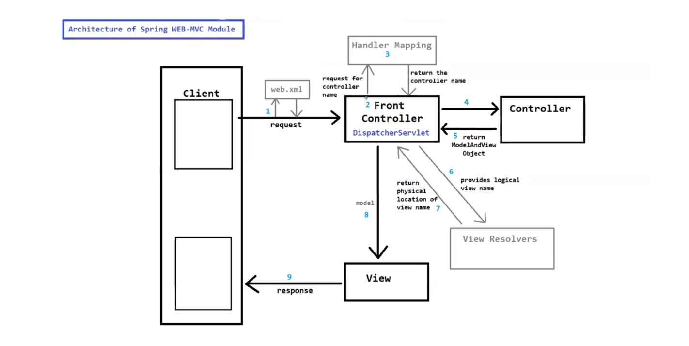

# 🌱 Spring Web Notes

## 🌐 Spring WEB Module

- 📦 The Spring WEB Module is a part of the **Spring Framework**, designed for building flexible and loosely coupled web applications.
- 🛠️ It provides a clean and organized way to develop web applications using **Spring MVC** or **Spring WebFlux**, etc.

> 📝 **NOTE:**
> - 🔗 The **Spring WEB-MVC Module** is a part of the **Spring WEB Module**.
> - ⚙️ The Spring WEB Module provides the basic web-oriented integration features that the Spring WEB-MVC Module needs to operate.

---

## 🏗️ Spring WEB-MVC Module

- 🎯 The Spring WEB-MVC Module is used to build web applications following the **Model-View-Controller (MVC)** architectural/design pattern.
- 🧩 It is used to develop flexible web applications in an organized manner.

---

### 🏛️ Architecture of Spring WEB-MVC Application

---

---

---

### 🧱 Components of Spring WEB-MVC Module

1. 🚪 **Front Controller** (`DispatcherServlet`)
2. 🗺️ **Handler Mapping**
3. 🎮 **Controller**
4. 📊 **Model & ModelAndView**
5. 📥 **Command Classes**
6. 🔍 **View Resolvers**
7. 🖼️ **View**

---

✅ **Summary:** Spring WEB = foundation 🌐 | Spring WEB-MVC = MVC architecture built on top 🏗️