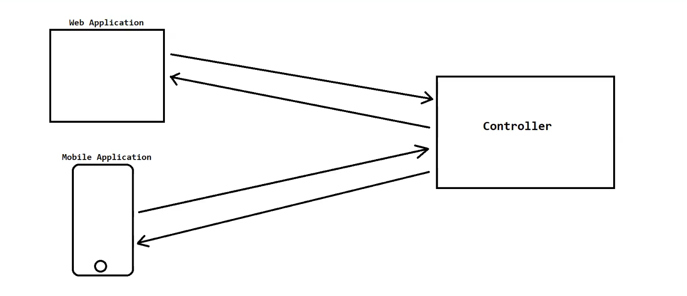

# 🌱 Spring WEB-MVC Module Notes

## 📦 Components of Spring WEB-MVC Module

1. 🚦 Front Controller (DispatcherServlet)
2. 🗺️ Handler Mapping
3. 🎮 Controller
4. 📝 Command Classes
5. 📊 Model & ModelAndView
6. 🔍 View Resolvers
7. 🖼️ View

---

## 🚦 Front Controller (DispatcherServlet)

- It is the controller that manages/handles **all client requests** and delegates them to other components.
- It acts as the **single entry point** for a Spring web application.

### ✅ Advantages of Front Controller

| # | Advantage | Description |
|---|-----------|--------------|
| 1️⃣ | **Centralized Control** | Single entry point for centralized control over request processing and common features like security, internationalization, etc. |
| 2️⃣ | **Flexibility** | Highly flexible and customizable request processing flow to meet specific application needs. |
| 3️⃣ | **Separation of Concerns** | Separates request processing logic for more modular and maintainable applications. |

> 💡 In Spring WEB-MVC, **`DispatcherServlet`** acts as the Front Controller.

- 🔄 Flow of DispatcherServlet in Spring WEB-MVC → 

---

- 🏗️ Hierarchy of DispatcherServlet (class) → *

---

## 🗺️ Handler Mapping

- Used to **map requests** to the proper controller and returns that controller name to the Front Controller.
- Spring WEB-MVC provides the **`HandlerMapping`** interface and its implemented classes.

### 🧩 Common HandlerMapping Implementations

1. `RequestMappingHandlerMapping` ⭐ *(default)*
2. `SimpleUrlHandlerMapping`
3. `BeanNameUrlHandlerMapping`
4. ...etc

### ⚙️ Ways to Provide Handler Mapping Configurations

1. 🗂️ XML Configurations
2. ☕ Java Configurations
3. 🏷️ Annotations
4. 🔎 Component Scanning
5. 🌐 Default URL Mapping

> 📌 **NOTE:** The most common ways are **Annotations** and **Component Scanning**, because they are simple and flexible.

---

## 🎮 Controller

- Controllers are the **heart** ❤️ of Spring WEB-MVC applications.
- Responsible for handling incoming requests, executing business logic, and returning a response.

### ✅ Advantages of Controllers

1. 🔀 Separates the presentation layer from the business layer.
2. ♻️ Can be reused across different applications.

3. 🧪 Easy to test and maintain.

### 🛠️ Ways to Create Controllers

1. 🧬 By inheriting the `Controller` interface or its implemented classes.
2. 🏷️ By `@Controller` annotation *(general purpose / traditional web apps)*.
3. 🏷️ By `@RestController` annotation *(RESTful controller)*.

> 📌 **NOTE:**
> - `Controller` interface & its implementations are **deprecated** from Spring 3.x onward → use annotations instead. ⚠️
> - For mapping, use `@RequestMapping`, `@GetMapping`, `@PostMapping`, etc. (for points 2 & 3).

### 🧭 Types of Controllers

| Type | Description |
|------|--------------|
| 📄 **Simple Controllers** | Handle basic requests such as returning a static HTML page or displaying a list of data. Typically don't interact with services/repositories. |
| 📝 **Form-Handling Controllers** | Handle requests from HTML forms — validate form data and perform actions like saving to DB or sending emails. |
| 🔗 **RESTful Controllers** | Implement the RESTful API design pattern; handle requests for resources like products, users, orders. Return JSON data. |

---

## 📝 Command Classes

- Normal **JavaBean class** or **POJO class**. 📦
- Used to store form data submitted by the client, making it available for business logic.

---

## 📊 Model & ModelAndView

### 📊 Model
- An **interface** representing a map of attributes that a controller uses to pass data to the view.
- Typically used to send dynamic data to be displayed on the view.

**➕ Adding data to Model:**
- `addAttribute(String name, Object value)`
- `addAllAttributes(Map<String, Object> attributes)`

**🔍 Retrieving data from Model:**
- `getAttribute(String name)`
- `containsAttribute(String name)`
- ✍️ Can also use **Expression Language (EL)**

### 🧩 ModelAndView
- A **class** that combines both **Model** and **view name** into a single object.
- Allows the controller to specify which view to render and what data should be available in it.

---

## 🔍 View Resolvers

- Used to resolve/translate the **logical view name** returned by the controller into the **actual physical view** to be rendered.

### 📋 Example

| Logical View Name | Actual Physical View |
|--------------------|------------------------|
| `home` | `WEB-INF/views/home.jsp` |
| `productDetails` | `WEB-INF/templates/productDetails.html` |

> 📌 **NOTE:** To get the actual physical name, **prefix** and **postfix** are added to the logical view name.

### 🧩 Implemented Classes of ViewResolver

1. `InternalResourceViewResolver` ⭐ *(default — used for JSP view)*
2. `ResourceBundleViewResolver`
3. `XmlViewResolver`
4. `BeanNameViewResolver`
5. `URLBasedViewResolver`
6. `ThymeleafViewResolver` 🍃 *(used for Thymeleaf view)*
7. `VelocityViewResolver` 🚀 *(used for Velocity view)*
8. `FreeMarkerViewResolver` ❄️ *(used for FreeMarker view)*

---

## 🖼️ View

- The **presentation/UI** sent to the client as a response.
- Common view technologies: 🌐 HTML, ☕ JSP, 🍃 Thymeleaf, 🚀 Velocity, ❄️ FreeMarker, etc.

---

## 🗂️ web.xml File

- The **deployment descriptor** file — part of every JavaEE application.

### 🔧 Responsibilities of web.xml

1. 👋 Welcome file configurations
2. 🖥️ Servlets configurations
3. ⏱️ Session timeout configurations
4. 🧵 Filters configurations
5. 👂 Listeners configurations
6. 🏷️ Context parameters configurations
7. 🚫 Error page configurations
8. ...etc

> 💡 In Spring WEB-MVC, its main task is to **configure the Front Controller** (i.e., DispatcherServlet).

> 📁 Location: created inside the **`WEB-INF`** folder.

---

## ⚙️ Spring Configuration XML File

- An **XML file** used to configure:
  1. 🫘 Bean classes
  2. 🗺️ Handler mapping classes
  3. 🎮 Controller classes
  4. 🔍 View resolver classes
  5. ...etc

> 📛 **Default name:** `[servlet-name]-servlet.xml` 

> 📁 **Location:** created inside the **`WEB-INF`** folder.

---

✨ *End of Notes* ✨