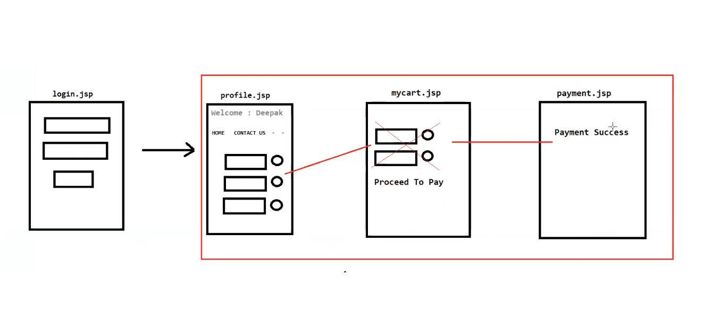

# 📝 HttpSession vs @SessionAttributes

## 🌐 HttpSession

- 🖥️ `HttpSession` is a **server-side mechanism** in Java Servlets and JSP that allows web applications to store and retrieve **user-specific information** across multiple requests.
- 🔄 It enables **session management**, aiding in maintaining state and user data during a user's visit to the website.

---

## 🏷️ @SessionAttributes

- 💾 It is used to **store attributes in the session** for a specific handler's conversation.
- 🗨️ A **conversational session** is a sequence of requests that are related to each other.
  - 🛒 Example: A shopping cart conversation might consist of adding items to cart, viewing the cart, and checking out.
- 🧹 Attributes stored using `@SessionAttributes` will be **removed from the session** once the handler indicates that the conversational session is **complete**.
- ⚙️ This annotation is used to **manage session attributes**, simplifying the process of **injecting, storing, and accessing data** within controller methods.
- 🏗️ This annotation is mostly used at the **class level**.

---

## ⚖️ Difference between HttpSession and @SessionAttributes

| # | HttpSession | @SessionAttributes |
|---|-------------|---------------------|
| 1️⃣ | 🕐 Scope is for the **entire session** | ⏳ Scope is till the handler's **conversational session** |
| 2️⃣ | 📦 Stores data for a **longer period of time** | 🧳 Stores data for a **temporary purpose** |