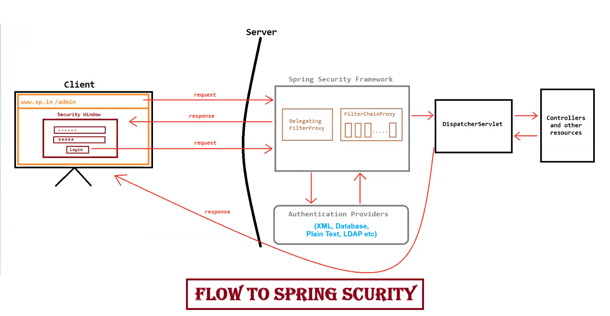

# 🔐 Spring Security Notes

> ⚠️ **Note:** We *can* achieve security in J2EE technologies (Servlets & JSP), but it's difficult to implement and limited in scope. Spring Security can be integrated with J2EE technologies to solve this. 🔗

---

## 📜 History

| Year | Event |
|------|-------|
| 🗓️ 2003 | Ben Alex started a project called **"Acegi Security System for Spring"** (not yet named Spring Security) |
| 🗓️ 2004 | **Spring Security v1.0** publicly released under the Apache License (still using the "Acegi" name) |
| 🗓️ 2008 | **Spring Security v2.0** released — official adoption of the **"Spring Security"** name 🎉 |
| 🗓️ Onwards | Regular new releases introduced continuously 🔄 |

---

## ✅ Advantages

1. 🪶 **Open Source & Lightweight** — Easy to use and adopt
2. ⚙️ **Highly Configurable & Pluggable** — Supports Java, Annotations & XML configs; integrates with Spring Data, Spring WebFlux, LDAP, Spring MVC, Spring Boot etc.
3. 🛡️ **Strong Security Measures** — Protects against session fixation, clickjacking, XSS, CSRF, etc.
4. 🔑 **Modern Authentication Support** — Social logins, token-based auth, MFA (multi-factor authentication)
5. 🌍 **Extensive Community & Ecosystem** — Rich docs, tutorials, and libraries
6. 🔧 **Continuous Updates** — Regular bug fixes, security enhancements & new features

---

## 🧩 Types of Spring Security Features

### 🔑 Authentication

1. 💾 **In-memory Authentication**
   - Good for testing/demos ⚠️ Not recommended for production (security risk)

2. 🌐 **Web-based Authentication**
   - 🪟 **HTTP Basic** — Popup window asking for username & password
   - 🔒 **HTTP Digest** — Sends credentials securely via hashes

3. 📝 **Form-based Authentication**
   - 🖊️ **Custom Forms** — Login via custom username/password forms
   - 🤖 **Captcha** — Added bot-protection layer

4. 🗄️ **Database Authentication**
   - 🛢️ **JDBC** — Authenticate against credentials in a relational DB
   - 🧾 **Custom Database** — Custom queries to validate credentials
   - 📇 **LDAP** — Centralized user management via LDAP server

5. 👥 **Social Login**
   - 🆔 **OpenID Connect** — SSO with providers like Google/Facebook
   - 🔐 **OAuth 2.0** — Auth via third-party authorization servers

6. 🍪 **Remember-me Authentication**
   - Stores a cookie for automatic login after first success

7. 🎫 **Token-based Authentication**
   - 📦 **JWT (JSON Web Tokens)** — Securely transmits user info between apps

### 🛂 Authorization

1. 👤 **Role-based Access Control (RBAC)**
2. 🎟️ **Permission-based Access Control (PBAC)**
3. 🌐 **URL-based Access Control**
4. 🔌 **API Security**

### ➕ Additional Features

- 🚫 **CSRF Protection** (Cross-Site Request Forgery)
- 🚫 **XSS Protection** (Cross-Site Scripting)

---

## 🎯 Two Main Focus Areas

> Spring Security primarily focuses on **Authentication** 🔑 and **Authorization** 🛂

### 🔑 Authentication
- Verifies **who the user is** (identity check) ✅
- The **first line of security** before granting resource access 🚧

**Types:**
1. 🧠 **Knowledge-Based**
   - Username & password
   - PIN codes
   - Security questions
2. 📱 **Possession-Based**
   - Phone/text messages (OTP)
   - Key cards & badges
   - Access token devices
3. 👁️ **Biometric**
   - Fingerprint
   - Iris scan

### 🛂 Authorization
- Grants **specific permissions/actions** based on roles (admin 👑, user 🙋, guest 👤)
- Happens **after** successful authentication ➡️
- Grants specific privileges within the app 🔓

**Examples:**
1. 🎭 **Role-based Authorization** — Roles (admin/user/guest) with defined permissions
2. 🏷️ **Attribute-based Authorization** — Access based on attributes (e.g., department level)

---

## 🔄 Flow of Spring Security

> 📊 Diagram — 

---

## 🧱 Two Key Components

### 1️⃣ DelegatingFilterProxy
- 🎯 Acts as the **central entry point** for Spring Security
- 🔀 Intercepts **all requests** and delegates them to the correct security filter based on rules
- 🧰 Makes security setup **simple & flexible**

### 2️⃣ FilterChainProxy
- 📐 An **interface** defining how to manage & execute chains of security filters:
  - `AuthorizationFilter`
  - `UsernamePasswordAuthenticationFilter`
  - `CsrfFilter`
  - `ExceptionTranslationFilter`
  - ...and more
- 🛠️ Provides methods to:
  - Access filter chains
  - Determine the right chain for a request
  - Integrate with the application context

---

✨ *End of Notes* ✨