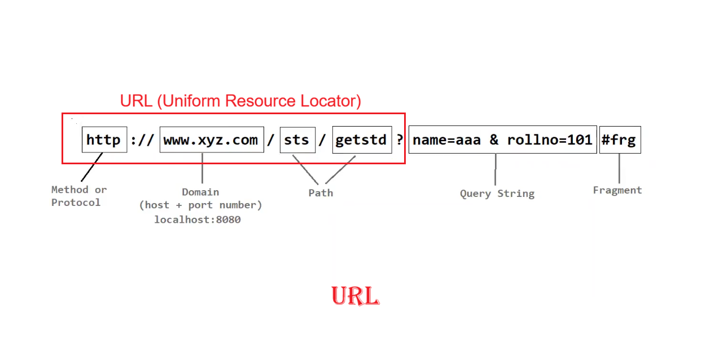
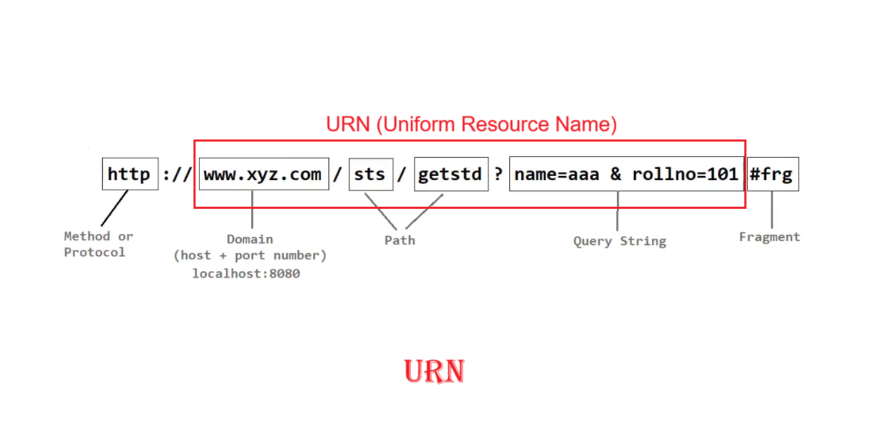
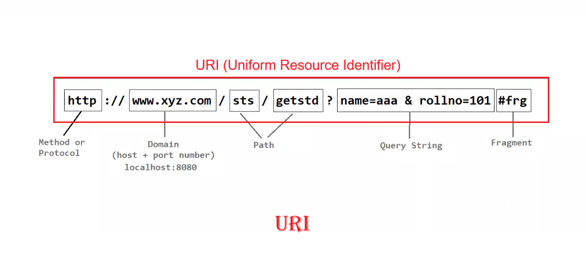

# 📘 Web Services & HTTP Notes

---

## 📂 Resources

- 🗂️ A **Resource** is a simple file — like HTML, images, or data — present on a server.
- 🔗 To access a resource from the server, we use a **URI**.

---

## URI , URN, URL

---

## 🌐 HTTP

- 📝 Full form: **Hyper Text Transfer Protocol**
- 🔌 HTTP is a **protocol** (TCP/IP based communication protocol) used to transfer resources over the **WWW** (World Wide Web).
- 🧩 Other common protocols:
  - 📁 **FTP** – File Transfer Protocol
  - 📧 **SMTP** – Simple Mail Transfer Protocol
  - 📬 **IMAP** – Internet Message Access Protocol
  - 📎 **MIME** – Multipurpose Internet Mail Extension
  - ➕ etc.
- 👨‍💻 HTTP was developed by **Tim Berners-Lee** and his team.
- 📡 HTTP request methods:
  - `GET` 📥
  - `POST` 📤
  - `PUT` 🔄
  - `PATCH` 🩹
  - `DELETE` 🗑️
  - ➕ etc.

---

## ⚔️ SOAP vs REST

| 🧷 SOAP | 🌀 REST |
|---|---|
| Simple Object Access **Protocol** | REpresentational State **Transfer** |
| A strict **protocol** with defined standards | An **architectural style** with 6 flexible constraints |
| ❌ Cannot use REST (protocol ≠ architecture) | ✅ Can use SOAP if needed (architecture can include protocols) |
| 📄 Transfers data only in **XML** | 📦 Transfers data in **JSON, XML, Plain Text, HTML**, etc. |
| 🐘 Requires **more bandwidth** | 🐇 Requires **less bandwidth** |
| 🛠️ **Difficult** to implement | ⚡ **Easy** to implement |
| 🕰️ Considered **outdated** | 🚀 Considered **modern/traditional** choice today |

---

## 🔍 REST vs RESTful

- 📏 **REST** = a set of constraints. The **6 main constraints** are:
  1. 🖥️ Client-Server Architecture
  2. 🚫💾 Stateless
  3. 🎯 Uniform Interface
  4. ⚡ Cacheable
  5. 🧱 Layered System
  6. 🧑‍💻 Code on Demand *(optional)*
- ✅ **RESTful** = an API that **adheres to** these REST constraints.

---

## 🧭 RESTful Web Services

- 🔡 **REST** breakdown:
  - **RE**presentational → supports **JSON** and **XML**
  - **S**tate → the data/value of an object
  - **T**ransfer → sending the state using the **HTTP** protocol
- 🧑‍🔬 REST was developed by **Roy Fielding** (the only person credited with providing the HTTP specification).
- 🏗️ RESTful web services can be built using multiple frameworks:
  - ☕ JAX-RS
  - 🍃 Spring Boot
  - 🧵 Jersey
  - ➕ etc.

---

## 🗃️ XML & JSON Format

- 📄 Two common data-interchange formats used in web services.
- 🏷️ **XML** – tag-based, verbose, used mainly by SOAP.
- 🔑 **JSON** – lightweight, key-value based, widely used in REST.

---

## 🧪 Postman

- 🛠️ A tool used to **test RESTful APIs**.

---