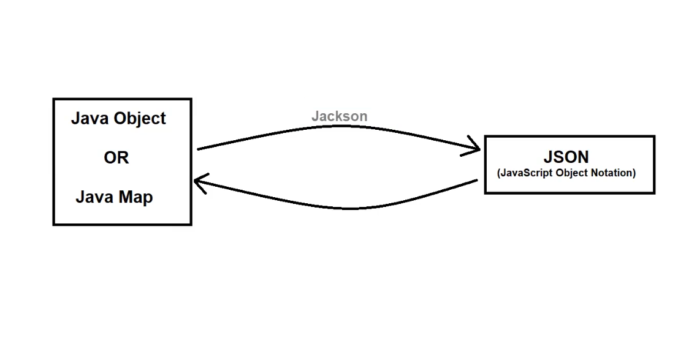

# 📦 Jackson (Java JSON Library)

## 📝 What is Jackson?
- Jackson is a popular **JSON** (JavaScript Object Notation) processing library in Java. 🟨
- It is used to **convert/serialize** Java Objects/Map to JSON and **vice-versa**. 🔄

---

## ✨ Features
1. 😃 Easy to use
2. ⚡ High Performance
3. 🚫🗺️ No need to create mapping
4. 🤝 Integration with Java frameworks
5. 🆓 Open Source (free to use)
6. 🔗❌ No Dependency

---
### Jackson

---

## 🛠️ Ways Jackson Processes JSON

Jackson provides **3 ways** to process JSON:

### 1️⃣ Data Binding 🔗
> A way to convert JSON ↔️ POJO using property accessors or annotations.

**Types:**
- **A. Simple Data Binding** 🧩
  - Converts JSON ↔️ Java `Map`, `List`, `String`, `Number`, `Boolean`, and `null` objects.
- **B. Full Data Binding** 🧱
  - Converts JSON ↔️ any Java type.

**Classes/Interfaces used:**
- 🅰️ `ObjectMapper`
- 🅱️ `ObjectReader`
- 🅲️ `ObjectWriter`

---

### 2️⃣ Streaming API 🌊
> Processes JSON data in a **streaming manner** — read/write incrementally without loading the entire JSON into memory.

- 💪 Most **powerful** approach among the three.
- 📉 Useful for **large JSON documents** or continuous JSON streams — efficient & memory-friendly. 🧠💾

**Classes/Interfaces used:**
- 🅰️ `JsonParser`
- 🅱️ `JsonGenerator`

---

### 3️⃣ Tree Model 🌳
> Creates an **in-memory tree representation** of the JSON document — similar to a DOM tree. 🕸️

- 🐢 Not as fast as Streaming API.
- 🤸 Most **flexible** approach to read and write JSON data.

**Classes/Interfaces used:**
- 🅰️ `JsonNode`
- 🅱️ `ObjectNode`
- 🅲️ `ArrayNode`
- ➕ etc.

---

## 📌 Quick Summary Table

| Approach       | Speed 🚀 | Flexibility 🤸 | Memory Usage 💾 |
|----------------|:--------:|:--------------:|:---------------:|
| Data Binding   | ⚡⚡      | ⭐⭐            | Moderate         |
| Streaming API  | ⚡⚡⚡    | ⭐              | Low (Best) ✅    |
| Tree Model     | ⚡        | ⭐⭐⭐          | High             |